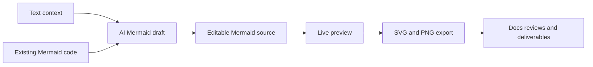
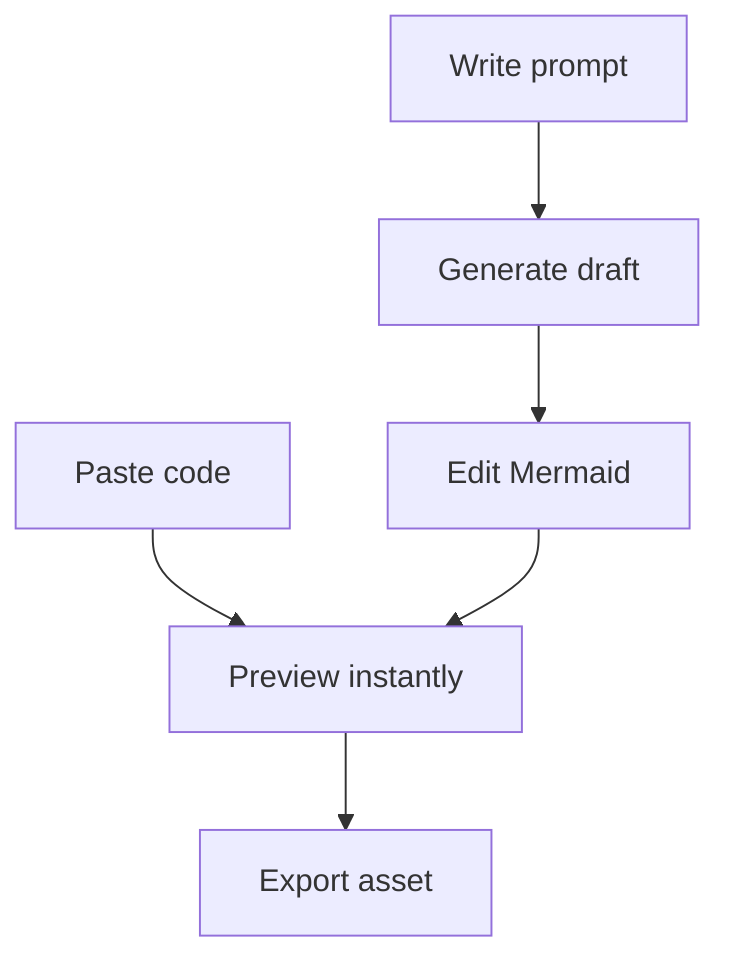

# Mermaid Generator

  

  A focused workspace for turning rough ideas into polished Mermaid diagrams.

  
  
  
  
  
  

## Why Mermaid Generator

Mermaid Generator is being built for a simple reason: diagram work is usually fragmented.

You write Mermaid in one place, sanity-check it in another, open an AI tool somewhere else to get a first draft, then spend extra time exporting something presentable. This project compresses that into one loop:

- paste Mermaid and refine it visually;
- describe a diagram in plain language and generate a first draft through the selected provider;
- preview immediately;
- export a clean asset when the diagram is ready.

## What The Product Promises

- One focused workspace instead of three disconnected tools.
- Mermaid remains the editable source of truth.
- AI helps users start faster without hiding the underlying diagram code.
- Export is part of the main experience, not an afterthought.
- First-run onboarding explains the workspace before the user has to guess the flow.

## Two Main Entry Points

### 1. Start From Existing Mermaid

Paste Mermaid source, edit it, and watch the preview update as you refine the structure.

### 2. Start From Plain Language

Describe the system, process, or flow you want to visualize. Mermaid Generator turns that prompt into a first diagram draft you can inspect and edit directly.

## Current Workspace Behavior

- Sticky workspace header that keeps shell controls available while the page scrolls.
- Compact header actions for fit, reset, zoom, focus mode, export, and settings.
- Mobile collapses those header actions into a single burger menu rather than duplicating preview-local controls.
- Focus mode keeps the main header and turns everything below it into the preview surface.
- Contextual help popovers for Mermaid source, prompt draft, and preview when focus mode is not active.
- Modal export flow with SVG output plus PNG scale selection.
- First-run onboarding with five steps: welcome, editor, prompt, preview, and export.
- Browser-first multi-provider settings for OpenAI, OpenRouter, and Anthropic keys.
- Generated Mermaid is validated before it can replace the editor source, and failed preview renders fall back to app-owned error copy rather than raw Mermaid parser output.
- Light generation guardrails that bias prompts toward balanced diagrams and warn when the result is still unusually wide or tall.

## Provider Setup

Prompt-based generation stays bring-your-own-key and browser-first for now.

- Open `Settings`.
- Select the provider you want to use.
- Save its API key locally in the browser.
- Switch the active provider at any time without losing the other saved keys.

The active provider controls whether the prompt surface is unlocked and which adapter handles generation.

## Export Flow

- Use `Export` from the main header.
- Choose `SVG` for vector output.
- Choose `PNG` when you need a raster image, then pick the output scale.
- Downloads always use the full rendered diagram rather than the current pan or zoom position.

## What Makes It Different

- It is intentionally narrow: Mermaid authoring, not a general-purpose whiteboard.
- It is intended to stay static-host friendly and PWA-eligible.
- It is designed so the future app can align with the proven delivery patterns already used in the author's other projects.

## Product Snapshot

