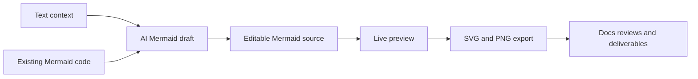
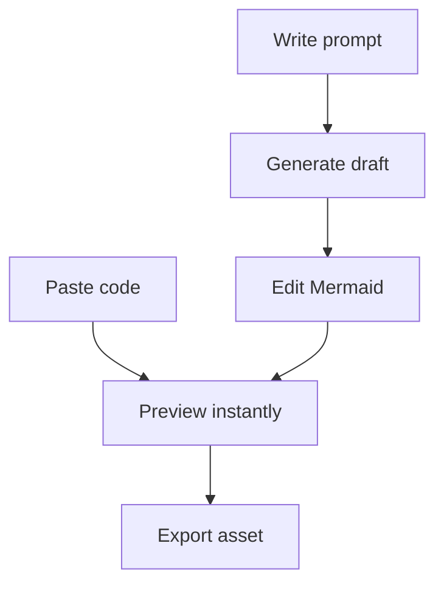

# Mermaid Generator

  

  A focused workspace for turning rough ideas into polished Mermaid diagrams.

  
  
  
  
  
  

## Why Mermaid Generator

Mermaid Generator exists for a simple reason: diagram work is usually fragmented.

You write Mermaid in one place, sanity-check it in another, open an AI tool somewhere else to get a first draft, then spend extra time exporting something presentable. This project compresses that into one loop:

- paste Mermaid and refine it visually;
- describe a diagram in plain language and generate a first draft through the selected provider;
- preview immediately;
- export a clean asset when the diagram is ready.

## What The Product Promises

- One focused workspace instead of three disconnected tools.
- Mermaid remains the editable source of truth.
- AI helps users start faster without hiding the underlying diagram code.
- Export is part of the main experience, not an afterthought.
- First-run onboarding explains the workspace before the user has to guess the flow.

## Two Main Entry Points

### 1. Start From Existing Mermaid

Paste Mermaid source, edit it, and watch the preview update as you refine the structure.

### 2. Start From Plain Language

Describe the system, process, or flow you want to visualize. Mermaid Generator turns that prompt into a first diagram draft you can inspect and edit directly.

## Current Workspace Behavior

- Sticky workspace header that keeps shell controls available while the page scrolls.
- Compact header actions for fit, reset, zoom, focus mode, export, and settings.
- Mobile collapses those header actions into a single burger menu rather than duplicating preview-local controls.
- Focus mode keeps the main header and turns everything below it into the preview surface.
- Contextual help popovers for Mermaid source, prompt draft, and preview when focus mode is not active.
- Modal export flow with SVG output, PNG scale selection, and share-link copy from the same surface.
- Shared modal scroll and overlay rules keep Settings, Export, and onboarding usable on short viewports while mobile modals fully dominate the page and desktop preserves only the header as a shell exception.
- First-run onboarding with five steps: welcome, editor, prompt, preview, and export.
- Browser-first multi-provider settings for OpenAI, OpenRouter, Anthropic, Grok, Mistral, and Gemini keys.
- Explicit Anthropic browser warning copy so the CORS limitation is visible before generation fails.
- In-app changelog history accessible from `Settings` and the mobile navigation menu.
- Generated Mermaid is validated before it can replace the editor source, and failed preview renders fall back to app-owned error copy rather than raw Mermaid parser output.
- Preview rendering uses Mermaid strict mode plus SVG sanitization before the preview injects markup into the page.
- Light generation guardrails that bias prompts toward balanced diagrams and warn when the result is still unusually wide or tall.
- Settings and export radiogroups now support arrow-key navigation with roving focus.
- Production delivery now includes a Render CSP, Firefox smoke coverage, and PNG PWA icons for installability.

## Provider Setup

Prompt-based generation stays bring-your-own-key and browser-first for now.

- Open `Settings`.
- Select the provider you want to use.
- Save its API key locally in the browser.
- Switch the active provider at any time without losing the other saved keys.

Supported direct providers:

- `OpenAI`
- `OpenRouter`
- `Anthropic`
- `Grok`
- `Mistral`
- `Gemini`

The active provider controls whether the prompt surface is unlocked and which adapter handles generation.

Provider note:

- `Anthropic` remains available, but direct browser calls are blocked by CORS on standard origins. Use it only if you route requests through a local proxy that adds the required permissions.

## Export Flow

- Use `Export` from the main header.
- Choose `SVG` for vector output.
- Choose `PNG` when you need a raster image, then pick the output scale.
- Use `Copy share link` when you want a URL that restores the current Mermaid source directly in the app.
- Downloads always use the full rendered diagram rather than the current pan or zoom position.

## Changelog In App

- Open `Settings`, then use `View changelog history`.
- On mobile, the same action is available from the burger menu.
- The changelog modal loads the curated release-note files from `changelogs/` and lets users browse the available history inside the app.

## Accessibility And Cross-Browser Coverage

- Provider, format, and PNG scale radiogroups follow the expected arrow-key navigation pattern.
- The smoke suite runs on both Chromium and Firefox.
- Preview zoom, share-link restore, modal flows, and onboarding are covered in E2E.

## Deployment On Render

Canonical Render contract:

- Service type: `Static Site`
- Root directory: leave empty
- Build command: `npm ci && npm run build`
- Publish directory: `dist`
- Production branch: `release`

Release source strategy:

- `main` stays the integration branch.
- `release` is the branch Render should deploy.
- Version tags such as `v0.1.0` mark release snapshots and GitHub releases.
- Promote validated release work from `main` to `release`, then push `main`, `release`, and the version tag.

Operator validation and rollback:

- Before promotion, run `npm run lint`, `npm run typecheck`, `npm run test`, `npm run build`, `npm run quality:pwa`, and `npm run test:e2e`.
- After deploy, verify the live header/footer version, editor-to-preview sync, export modal, share-link restore flow, provider settings, and mobile navigation.
- If a release is broken, move `release` back to the last known good commit or redeploy the last known good tag, then let Render rebuild from that point.

Delivery note:

- Render now treats hashed `/assets/*` files as long-lived immutable assets.
- The PWA precache deliberately excludes the heaviest Mermaid runtime chunks so install/update cost stays bounded while runtime asset caching still warms them during normal online use.
- `render.yaml` now adds a route-wide `Content-Security-Policy` that keeps `script-src 'self'`, blocks `unsafe-eval`, and restricts outbound provider fetches to the six supported APIs.

PWA note:

- The manifest now ships the existing SVG icon plus `192x192` and `512x512` PNG icons so install prompts have browser-friendly assets.

## What Makes It Different

- It is intentionally narrow: Mermaid authoring, not a general-purpose whiteboard.
- It is intended to stay static-host friendly and PWA-eligible.
- It is designed so the future app can align with the proven delivery patterns already used in the author's other projects.

## Product Snapshot

## Contributing

Contribution guidelines are available in [`CONTRIBUTING.md`](CONTRIBUTING.md).

## License

This project is licensed under the MIT License. See [`LICENSE`](LICENSE).
