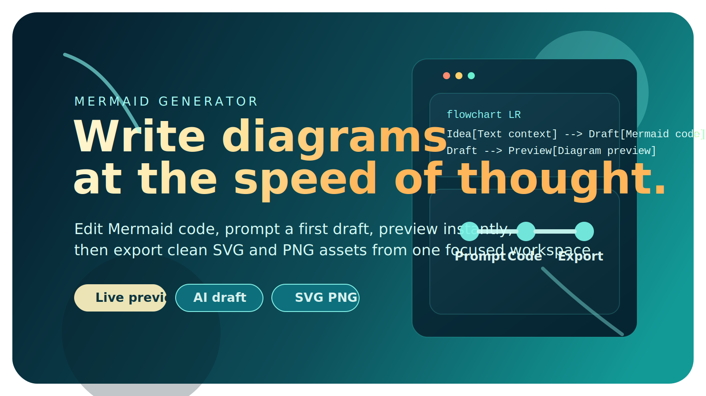
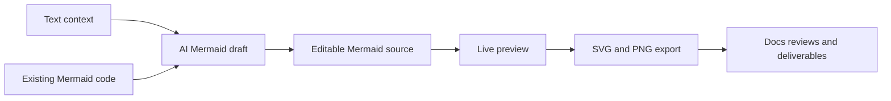
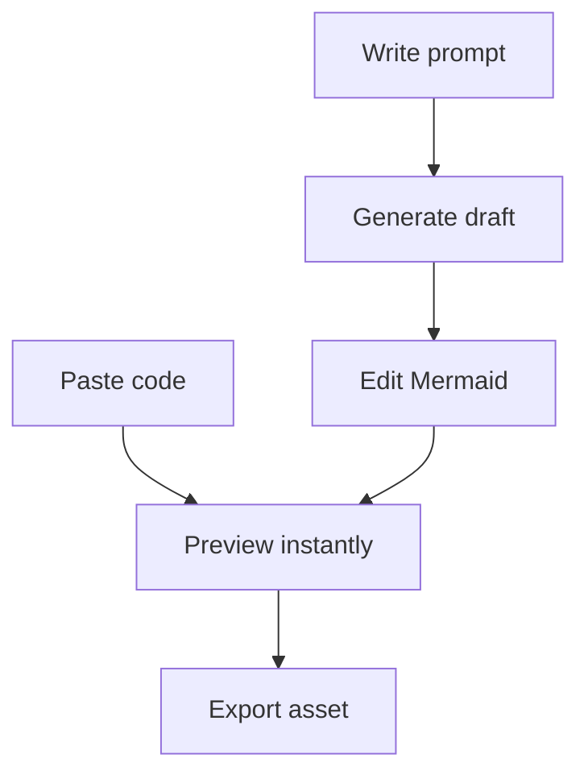
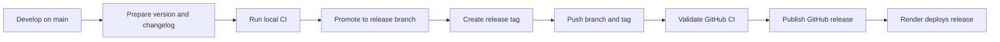

# Mermaid Generator

  

  

  A focused workspace for turning rough ideas into polished Mermaid diagrams.

  
  
  
  
  
  

## Why Mermaid Generator

Mermaid Generator is being built for a simple reason: diagram work is usually fragmented.

You write Mermaid in one place, sanity-check it in another, open an AI tool somewhere else to get a first draft, then spend extra time exporting something presentable. This project compresses that into one loop:

- paste Mermaid and refine it visually;
- describe a diagram in plain language and generate a first draft;
- preview immediately;
- export a clean asset when the diagram is ready.

## What The Product Promises

- One focused workspace instead of three disconnected tools.
- Mermaid remains the editable source of truth.
- AI helps users start faster without hiding the underlying diagram code.
- Export is part of the main experience, not an afterthought.

## Two Main Entry Points

### 1. Start From Existing Mermaid

Paste Mermaid source, edit it, and watch the preview update as you refine the structure.

### 2. Start From Plain Language

Describe the system, process, or flow you want to visualize. Mermaid Generator turns that prompt into a first diagram draft you can inspect and edit directly.

## What Makes It Different

- It is intentionally narrow: Mermaid authoring, not a general-purpose whiteboard.
- It is intended to stay static-host friendly and PWA-eligible.
- It is designed so the future app can align with the proven delivery patterns already used in the author's other projects.

## Product Snapshot

## Planned Release Flow

The project will use a gated release path rather than deploying every development commit directly to production.

## Repository Direction

This repository is currently in the early planning and bootstrap phase.

- Core product framing: [request](logics/request/req_000_launch_mermaid_generator_web_app.md)
- Brand, README, and release-doc slice: [request](logics/request/req_001_create_branding_assets_marketing_readme_and_release_workflow_docs.md)
- Static app direction: [ADR](logics/architecture/adr_000_choose_a_static_pwa_architecture_for_mermaid_generator.md)
- Release branch deployment workflow: [ADR](logics/architecture/adr_001_define_static_deployment_and_release_branch_workflow.md)

## Early Asset Inventory

- App icon: [`assets/branding/app-icon.svg`](assets/branding/app-icon.svg)
- Favicon base: [`assets/branding/favicon.svg`](assets/branding/favicon.svg)
- README hero banner: [`assets/branding/readme-hero.svg`](assets/branding/readme-hero.svg)

## Later, Once The MVP Exists

The next README iteration can add:

- a real CI badge once the GitHub repository is live;
- a production badge once the Render static site is connected;
- screenshots of the editor and generated preview flow;
- developer setup steps once the stack bootstrap is committed.
