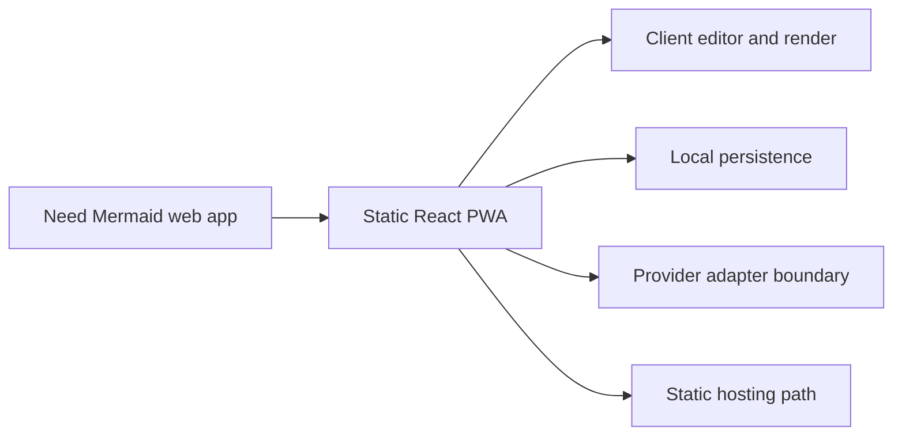

## adr_000_choose_a_static_pwa_architecture_for_mermaid_generator - Choose a static PWA architecture for Mermaid Generator
> Date: 2026-04-02
> Status: Draft
> Drivers: Static hosting, PWA eligibility, local-first authoring, fast iteration, provider flexibility, and alignment with the reference stack.
> Related request: `req_000_launch_mermaid_generator_web_app`
> Related backlog: (none yet)
> Related task: (none yet)
> Reminder: Update status, linked refs, decision rationale, consequences, migration plan, and follow-up work when you edit this doc.

# Overview
Mermaid Generator should start as a static React and TypeScript single-page app with PWA support and local-first authoring flows.
Mermaid rendering, preview updates, and export should stay in the client so the core editor remains deployable on static hosting.
AI generation should be abstracted behind a provider boundary so the first OpenAI path does not lock the product to one vendor.
Managed provider secrets should not be embedded in the public client; if managed keys are needed later, they should sit behind an optional proxy service.

# Context
The requested product needs a browser-based Mermaid editor and viewer with live preview, AI-assisted generation, and export.
The project should stay close to the delivery profile of `electrical-plan-editor`, whose public repository shows a React 19, TypeScript, Vite, `vite-plugin-pwa`, Render static hosting, Vitest, Playwright, and Logics workflow stack.

Key constraints:

- The app should stay eligible for static deployment and PWA behavior.
- The core editing and preview experience should not require a backend to function.
- AI generation should start with OpenAI compatibility but leave space for additional providers.
- Provider secrets cannot be safely shipped as project-managed secrets inside a public static client bundle.

# Decision
Adopt a static SPA architecture aligned with the reference project:

- React and TypeScript for the application shell and editor UI.
- Vite for local development and production build output.
- `vite-plugin-pwa` for installability and offline shell behavior.
- Static hosting on Render or an equivalent static platform.
- Client-side Mermaid rendering and client-side export flow for SVG and PNG.
- A provider adapter contract for AI generation, with an initial browser-compatible OpenAI path if users bring their own key, and a future-compatible hook for an optional proxy service when managed secrets or policy controls are required.
- Local browser persistence for the user-provided OpenAI key in the MVP, rather than a project-managed secret path, with product UX making that storage model explicit.

This direction keeps the core value proposition simple to host and fast to iterate on while isolating the only likely server-shaped concern: managed LLM credentials and policy enforcement.

# Alternatives considered
- Build a fullstack app from day one with a mandatory backend proxy for every AI request.
- Build a pure client app tightly coupled to OpenAI-specific request shapes and UI assumptions.
- Build a desktop-first tool instead of a static web app.

# Consequences
- The editor, preview, and export flows can remain available on static hosting and can support offline-friendly behavior after initial asset caching.
- The initial delivery can reuse proven stack and deployment patterns from `electrical-plan-editor`.
- AI generation remains online-only and needs explicit UX around provider configuration, connectivity, and failures.
- The MVP accepts the trade-off of local browser key persistence because it keeps the product static and removes the need for a managed backend secret path.
- If the product later needs centrally managed API keys, quotas, or audit controls, an additional proxy layer will be required behind the same provider contract.
- Frontend implementation quality now has an explicit delivery guardrail: use the `logics-ui-steering` skill whenever generating or refining product UI code for this app.

# Migration and rollout
- Bootstrap the repo with the same baseline stack profile as the reference app: React, TypeScript, Vite, PWA plugin, Render static blueprint, and Logics workflow.
- Implement the core local editor, live preview, and export path first so the product is usable without AI.
- Add a provider adapter and a first OpenAI integration path without leaking project-managed secrets into the client bundle.
- Add an optional proxy mode later only if shared provider credentials, rate governance, or provider normalization becomes necessary.

# References
- `logics/request/req_000_launch_mermaid_generator_web_app.md`
- `logics/product/prod_000_mermaid_generator_product_direction.md`
- Reference app: `https://e-plan-editor.onrender.com/`
- Reference repository: `https://github.com/AlexAgo83/electrical-plan-editor`

# Follow-up work
- Bootstrap the application shell and static deployment baseline.
- Define the Mermaid document state model, preview pipeline, and export pipeline.
- Define the AI provider interface and the first prompt-to-Mermaid contract.
- Decide whether the first AI release is bring-your-own-key only or includes a managed proxy path.
- Apply `logics-ui-steering` during future UI implementation waves so the editor layout stays product-native and avoids generic AI-tool patterns.
