## adr_001_define_static_deployment_and_release_branch_workflow - Define static deployment and release branch workflow
> Date: 2026-04-02
> Status: Draft
> Drivers: Predictable releases, branch separation between development and production, static hosting on Render, GitHub-based traceability, and reuse of the user's established release discipline.
> Related request: `req_001_create_branding_assets_marketing_readme_and_release_workflow_docs`
> Related backlog: (none yet)
> Related task: (none yet)
> Reminder: Update status, linked refs, decision rationale, consequences, migration plan, and follow-up work when you edit this doc.

# Overview
Mermaid Generator should keep day-to-day development on `main` and use a dedicated `release` branch as the Render deployment source once the remote repository exists.
Releases should stay intentionally gated instead of deploying every `main` commit directly to production.
The release operation should bundle version bump, changelog curation, local CI validation, promotion to `release`, tagging, push, GitHub CI validation, and GitHub release publication.
This keeps the deployment path aligned with the user's established project operations while staying simple for a static app.

```mermaid
flowchart LR
    Main[Main branch development] --> Prep[Prepare release]
    Prep --> LocalCI[Run local CI]
    LocalCI --> ReleaseBranch[Apply changes to release branch]
    ReleaseBranch --> Tag[Create version tag]
    Tag --> Push[Push branches and tag]
    Push --> GitHubCI[Validate GitHub CI]
    GitHubCI --> Publish[Create GitHub release]
    Publish --> Render[Render deploys release branch]
```

# Context
The project will start locally and be published later to GitHub, then connected to a Render Static Site.
The user already follows a release discipline on other projects and wants Mermaid Generator to inherit the same predictable flow instead of inventing a new deployment model.

Operational constraints:

- `main` should remain the normal development branch.
- Render should later build from `release`, not directly from `main`.
- Release preparation should explicitly include versioning and changelog work.
- Local CI validation should happen before promoting a release candidate.
- GitHub tags and GitHub Releases remain part of the official delivery trail.

# Decision
Adopt a branch-gated static deployment workflow:

- `main` is the integration branch for normal development and MVP iteration.
- `release` is the deployment branch that Render tracks for the production static website.
- A release starts on `main` by preparing the new version and updating changelog material.
- Before promotion, run the project CI checks locally.
- Once validated, apply the release changes onto `release`.
- Create the version tag as part of the release operation.
- Push `main`, `release`, and the tag to GitHub.
- Wait for GitHub CI validation, then create the GitHub Release entry.

This gives the project a controlled release gate without adding unnecessary infrastructure.

# Alternatives considered
- Deploy every push from `main` directly to Render.
- Keep only one branch and rely only on tags for release intent.
- Introduce a more automated release train before the project has enough stability to justify it.

# Consequences
- Production deploy intent remains explicit because only curated changes reach `release`.
- The workflow matches the user's existing habits, which lowers operational friction.
- Release prep has a small manual cost, but that cost buys traceability and rollback clarity.
- Documentation, versioning, changelog hygiene, and GitHub release notes become part of the normal shipping discipline instead of afterthoughts.

# Migration and rollout
- Keep the ADR as the target workflow while the project is still local-only.
- Once the repository is pushed to GitHub, create the `release` branch.
- Configure Render Static Site to build from `release`.
- Add or align GitHub CI so the same local validation path also exists remotely.
- Use the first MVP release to validate the branch promotion, tagging, and GitHub Release path end to end.

# References
- `logics/request/req_001_create_branding_assets_marketing_readme_and_release_workflow_docs.md`
- `README.md`

# Follow-up work
- Add repository versioning and changelog conventions to the bootstrap.
- Add CI scripts and release validation commands once the app stack exists.
- Wire Render Static Site to the `release` branch after the GitHub repository is published.
- Create a future delivery task or checklist that operationalizes the release steps in the repo.
