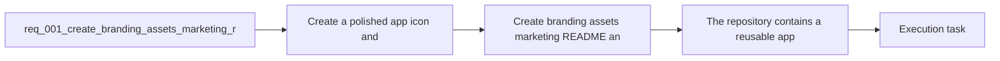

## item_000_create_branding_assets_marketing_readme_and_release_workflow_docs - Create branding assets, marketing README, and release workflow docs
> From version: 0.1.0
> Schema version: 1.0
> Status: Done
> Understanding: 96%
> Confidence: 96%
> Progress: 100%
> Complexity: Medium
> Theme: UI
> Reminder: Update status/understanding/confidence/progress and linked task references when you edit this doc.

# Problem
- The project needs a first brand layer and public-facing repository presentation before the MVP bootstrap is implemented.
- The repository also needs the release workflow ADR written down early so the future GitHub and Render setup follows an agreed path.

# Scope
- In:
  - App icon and README hero asset.
  - Marketing-oriented `README.md` with badges and Mermaid explainers.
  - ADR for the `main` to `release` static deployment workflow.
- Out:
  - Runtime application code.
  - Editor, preview, settings, or LLM feature implementation.

# Acceptance criteria
- The repository contains a reusable app icon asset suitable for future app integration.
- The repository contains at least one branded visual asset suitable for README presentation.
- The root `README.md` exists and presents the project in a product-first tone with badges and Mermaid diagrams.
- The repository contains an ADR that documents the intended `main` to `release` deployment and release workflow for static hosting on Render.
- The request links to the created companion architecture doc and references the concrete delivered files.

# AC Traceability
- AC1 -> Scope: The repository contains a reusable app icon asset suitable for future app integration. Proof: `assets/branding/app-icon.svg` exists and is reusable by the future app shell.
- AC2 -> Scope: The repository contains at least one branded visual asset suitable for README presentation. Proof: `assets/branding/readme-hero.svg` exists and is referenced by `README.md`.
- AC3 -> Scope: The root `README.md` exists and presents the project in a product-first tone with badges and Mermaid diagrams. Proof: `README.md` contains the hero asset, badge block, and Mermaid sections.
- AC4 -> Scope: The repository contains an ADR that documents the intended `main` to `release` deployment and release workflow for static hosting on Render. Proof: `logics/architecture/adr_001_define_static_deployment_and_release_branch_workflow.md` exists and describes the branch-gated release path.
- AC5 -> Scope: The request links to the created companion architecture doc and references the concrete delivered files. Proof: `req_001_create_branding_assets_marketing_readme_and_release_workflow_docs.md` lists the delivered assets and ADR in its references and backlog sections.

# Decision framing
- Product framing: Not needed
- Product signals: (none detected)
- Product follow-up: No product brief follow-up is expected based on current signals.
- Architecture framing: Required
- Architecture signals: data model and persistence, contracts and integration, delivery and operations
- Architecture follow-up: Create or link an architecture decision before irreversible implementation work starts.

# Links
- Product brief(s): (none yet)
- Architecture decision(s): `adr_001_define_static_deployment_and_release_branch_workflow`
- Request: `req_001_create_branding_assets_marketing_readme_and_release_workflow_docs`
- Primary task(s): `task_000_orchestrate_mermaid_generator_mvp_delivery`

# AI Context
- Summary: Create the first visible identity and repository-facing delivery docs for Mermaid Generator, including iconography, marketing README, and deployment...
- Keywords: branding, icon, readme, marketing, badge, release branch, render, github release, changelog
- Use when: Use when shaping repository presentation, brand assets, or release documentation for the early Mermaid Generator project.
- Skip when: Skip when the work concerns editor implementation, Mermaid rendering internals, or LLM provider integration logic.

# References
- `README.md`
- `assets/branding/app-icon.svg`
- `assets/branding/readme-hero.svg`
- `logics/architecture/adr_001_define_static_deployment_and_release_branch_workflow.md`
- `logics/skills/logics-ui-steering/SKILL.md`

# Priority
- Impact: Medium
- Urgency: Low

# Notes
- Derived from request `req_001_create_branding_assets_marketing_readme_and_release_workflow_docs`.
- This backlog item is already satisfied by the current planning wave and should now act as a baseline asset and documentation reference for later implementation work.
- Source file: `logics/request/req_001_create_branding_assets_marketing_readme_and_release_workflow_docs.md`.
- Request context seeded into this backlog item from `logics/request/req_001_create_branding_assets_marketing_readme_and_release_workflow_docs.md`.
