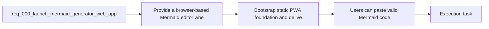

## item_001_bootstrap_static_pwa_foundation_and_delivery_baseline - Bootstrap static PWA foundation and delivery baseline

> From version: 0.1.0
> Schema version: 1.0
> Status: Done
> Understanding: 95%
> Confidence: 91%
> Progress: 100%
> Complexity: Medium
> Theme: UI
> Reminder: Update status/understanding/confidence/progress and linked task references when you edit this doc.

# Problem

- The project needs a concrete application baseline before feature work starts.
- The baseline must stay aligned with the static React, TypeScript, Vite, PWA, and Render-oriented architecture already selected for the product.
- The MVP also needs repository-level delivery hooks that can later support the planned `main` to `release` workflow.

# Scope

- In:
  - Bootstrap the static React and TypeScript app shell.
  - Configure Vite, PWA support, project scripts, and static hosting baseline.
  - Wire initial branding assets into the application shell where appropriate.
  - Prepare repository-level quality gates such as lint, test, build, and e2e placeholders or scripts consistent with the chosen stack.
  - Keep env files, README, and deployment-facing configuration aligned with the bootstrap.
- Out:
  - Final editor and preview interactions.
  - Settings modal and local OpenAI key gating behavior.
  - Full LLM generation UX polish.

# Acceptance criteria

- The repository is bootstrapped as a static React and TypeScript application aligned with the selected PWA-oriented architecture.
- The project contains the core build and quality commands needed for MVP delivery, including lint, test, build, and static app execution paths appropriate to the chosen stack.
- The baseline includes PWA and static hosting configuration suitable for later Render deployment.
- The initial application shell can load successfully and host the future editor, prompt, preview, and settings surfaces.
- The bootstrap reuses or carries forward the prepared branding and documentation assets where relevant.
- The resulting baseline is coherent with the existing product brief, static app ADR, and release workflow ADR.

# AC Traceability

- AC1 -> Scope: The repository is bootstrapped as a static React and TypeScript application aligned with the selected PWA-oriented architecture. Proof: project scaffold, dependencies, and app entrypoint exist and run locally.
- AC2 -> Scope: The project contains the core build and quality commands needed for MVP delivery, including lint, test, build, and static app execution paths appropriate to the chosen stack. Proof: package scripts execute successfully or are documented precisely if a stack-specific alias is used.
- AC3 -> Scope: The baseline includes PWA and static hosting configuration suitable for later Render deployment. Proof: PWA config and Render-facing static deployment files are present in the repo.
- AC4 -> Scope: The initial application shell can load successfully and host the future editor, prompt, preview, and settings surfaces. Proof: local app launch shows the shell without runtime boot failure.
- AC5 -> Scope: The bootstrap reuses or carries forward the prepared branding and documentation assets where relevant. Proof: app shell, manifest, or public assets reference the prepared branding files where applicable.
- AC6 -> Scope: The resulting baseline is coherent with the existing product brief, static app ADR, and release workflow ADR. Proof: linked docs remain current and no baseline choice contradicts the documented architecture or release path.

# Decision framing

- Product framing: Consider
- Product signals: pricing and packaging
- Product follow-up: Review whether a product brief is needed before scope becomes harder to change.
- Architecture framing: Required
- Architecture signals: data model and persistence, contracts and integration
- Architecture follow-up: Create or link an architecture decision before irreversible implementation work starts.

# Links

- Product brief(s): `prod_000_mermaid_generator_product_direction`
- Architecture decision(s): `adr_000_choose_a_static_pwa_architecture_for_mermaid_generator`
- Request: `req_000_launch_mermaid_generator_web_app`
- Primary task(s): `task_000_orchestrate_mermaid_generator_mvp_delivery`

# AI Context

- Summary: Build a focused Mermaid authoring web app with live preview, AI-assisted code generation, and export, while preserving a...
- Keywords: mermaid, editor, preview, export, llm, openai, provider adapter, pwa, static app
- Use when: Use when defining backlog slices for editor UX, Mermaid rendering, export, persistence, or AI provider integration.
- Skip when: Skip when the work is about unrelated diagram formats, multi-user collaboration, or non-web delivery targets.

# References

- `logics/product/prod_000_mermaid_generator_product_direction.md`
- `logics/architecture/adr_000_choose_a_static_pwa_architecture_for_mermaid_generator.md`
- `Reference app: `https://e-plan-editor.onrender.com/``
- `Reference repository: `https://github.com/AlexAgo83/electrical-plan-editor``
- `logics/skills/logics-ui-steering/SKILL.md`

# Priority

- Impact: High
- Urgency: High

# Notes

- This item is the foundation wave. Complete it before deeper workspace and provider work so later slices build on a stable shell.
- Completed in wave 1 with the React, TypeScript, Vite, PWA, Render, CI, and test baseline now present in the repository.

# Notes

- Derived from request `req_000_launch_mermaid_generator_web_app`.
- Source file: `logics/request/req_000_launch_mermaid_generator_web_app.md`.
- Request context seeded into this backlog item from `logics/request/req_000_launch_mermaid_generator_web_app.md`.
