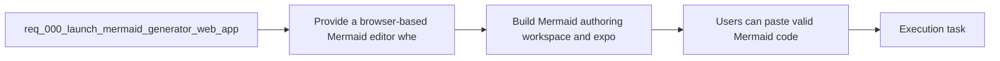

## item_002_build_mermaid_authoring_workspace_and_export_flow - Build Mermaid authoring workspace and export flow
> From version: 0.1.0
> Schema version: 1.0
> Status: Done
> Understanding: 95%
> Confidence: 90%
> Progress: 100%
> Complexity: Medium
> Theme: UI
> Reminder: Update status/understanding/confidence/progress and linked task references when you edit this doc.

# Problem
- The product needs a serious authoring workspace, not a generic AI tool layout.
- The preview must dominate the screen while the Mermaid editor and prompt remain immediately accessible.
- The app also needs full-diagram export and preview navigation so users can work with larger diagrams comfortably.

# Scope
- In:
  - Build the desktop-first three-part workspace with preview as the primary region, editor on the left, and prompt below the editor.
  - Integrate a real code editing surface appropriate for Mermaid authoring.
  - Render Mermaid live from editable source.
  - Add preview focus mode, zoom, pan, fit, reset, and export behaviors.
  - Define the prompt area and provider adapter hookup so prompt-based generation can insert Mermaid back into the editable source when enabled.
  - Apply `logics-ui-steering` during UI implementation.
- Out:
  - Local key persistence and settings modal logic.
  - Managed backend proxy for provider credentials.
  - Advanced collaboration or document management features.

# Acceptance criteria
- Users can paste valid Mermaid code into the editor and see a live rendered preview without a page reload.
- Users can edit Mermaid code in place and the preview updates fast enough for iterative authoring.
- The workspace layout matches the documented UX direction: preview dominant, editor left, prompt below the editor, with a fast preview focus mode.
- The preview supports zoom in, zoom out, reset, fit to screen, and drag-to-pan interactions suitable for diagram navigation.
- Users can export the rendered result as SVG and PNG, and exports capture the full diagram rather than the current navigation viewport.
- When provider access is available, prompt-based generation can produce Mermaid code and insert it back into the editable source area.

# AC Traceability
- AC1 -> Scope: Users can paste valid Mermaid code into the editor and see a live rendered preview without a page reload. Proof: manual or automated UI validation confirms source edits re-render the preview immediately.
- AC2 -> Scope: Users can edit Mermaid code in place and the preview updates fast enough for iterative authoring. Proof: the integrated editor updates the preview in normal typing flows without full-page refresh.
- AC3 -> Scope: The workspace layout matches the documented UX direction: preview dominant, editor left, prompt below the editor, with a fast preview focus mode. Proof: UI implementation matches the product brief layout and focus-mode behavior.
- AC4 -> Scope: The preview supports zoom in, zoom out, reset, fit to screen, and drag-to-pan interactions suitable for diagram navigation. Proof: toolbar and interaction checks confirm these controls work on rendered diagrams.
- AC5 -> Scope: Users can export the rendered result as SVG and PNG, and exports capture the full diagram rather than the current navigation viewport. Proof: exported files are generated in both formats and reflect the full diagram content.
- AC6 -> Scope: When provider access is available, prompt-based generation can produce Mermaid code and insert it back into the editable source area. Proof: enabled prompt flow returns Mermaid source and updates the editor content.

# Decision framing
- Product framing: Consider
- Product signals: pricing and packaging
- Product follow-up: Review whether a product brief is needed before scope becomes harder to change.
- Architecture framing: Required
- Architecture signals: data model and persistence, contracts and integration
- Architecture follow-up: Create or link an architecture decision before irreversible implementation work starts.

# Links
- Product brief(s): `prod_000_mermaid_generator_product_direction`
- Architecture decision(s): `adr_000_choose_a_static_pwa_architecture_for_mermaid_generator`
- Request: `req_000_launch_mermaid_generator_web_app`
- Primary task(s): `task_000_orchestrate_mermaid_generator_mvp_delivery`

# AI Context
- Summary: Build a focused Mermaid authoring web app with live preview, AI-assisted code generation, and export, while preserving a...
- Keywords: mermaid, editor, preview, export, llm, openai, provider adapter, pwa, static app
- Use when: Use when defining backlog slices for editor UX, Mermaid rendering, export, persistence, or AI provider integration.
- Skip when: Skip when the work is about unrelated diagram formats, multi-user collaboration, or non-web delivery targets.

# References
- `logics/product/prod_000_mermaid_generator_product_direction.md`
- `logics/architecture/adr_000_choose_a_static_pwa_architecture_for_mermaid_generator.md`
- `Reference app: `https://e-plan-editor.onrender.com/``
- `Reference repository: `https://github.com/AlexAgo83/electrical-plan-editor``
- `logics/skills/logics-ui-steering/SKILL.md`

# Priority
- Impact: High
- Urgency: High

# Notes
- This item owns the core UX of the product and should explicitly follow the layout and UI steering guidance already documented in the product brief.
- Completed in wave 2 with the dominant-preview workspace, Mermaid editing, focus mode, preview navigation, and full-diagram export now implemented in the app shell.

# Notes
- Derived from request `req_000_launch_mermaid_generator_web_app`.
- Source file: `logics/request/req_000_launch_mermaid_generator_web_app.md`.
- Request context seeded into this backlog item from `logics/request/req_000_launch_mermaid_generator_web_app.md`.
