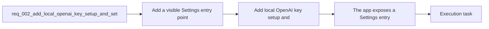

## item_003_add_local_openai_key_setup_and_settings_entry_point - Add local OpenAI key setup and settings entry point

> From version: 0.1.0
> Schema version: 1.0
> Status: Done
> Understanding: 96%
> Confidence: 93%
> Progress: 100%
> Complexity: Medium
> Theme: UI
> Reminder: Update status/understanding/confidence/progress and linked task references when you edit this doc.

# Problem

- The browser-first OpenAI path needs a user-facing configuration surface and a safe default state.
- The app must make it obvious that prompt-based generation depends on a locally configured user key.
- The first settings surface should solve this need cleanly without overbuilding an entire settings system.

# Scope

- In:
  - Add a visible `Settings` entry point to the application shell.
  - Implement the first settings surface as a modal.
  - Store the user-provided OpenAI API key in local browser persistence for the MVP.
  - Keep the prompt generation area visible but locked until a key is configured.
  - Provide explicit UX messaging that the key is stored locally on the current device and that `Settings` unlocks generation.
- Out:
  - Multi-provider settings management.
  - Server-side secret storage.
  - Advanced settings categories unrelated to MVP provider setup.

# Acceptance criteria

- The app exposes a `Settings` entry point that is intended to host current and future app options.
- The first settings surface is implemented as a modal and allows the user to enter and persist an OpenAI API key locally in the browser.
- When no local OpenAI key is configured, the prompt-based LLM generation feature remains visible but unavailable in the UI and the user sees a clear explanation plus a direct path to `Settings`.
- When a local OpenAI key is configured, the prompt-based generation flow becomes available without requiring a deployment-managed secret.
- The request stays aligned with the existing product brief and static architecture ADR for a browser-first bring-your-own-key setup.

# AC Traceability

- AC1 -> Scope: The app exposes a `Settings` entry point that is intended to host current and future app options. Proof: the application shell contains a visible settings control reachable from the main workspace.
- AC2 -> Scope: The first settings surface is implemented as a modal and allows the user to enter and persist an OpenAI API key locally in the browser. Proof: a modal saves and reloads the configured key from local browser persistence.
- AC3 -> Scope: When no local OpenAI key is configured, the prompt-based LLM generation feature remains visible but unavailable in the UI and the user sees a clear explanation plus a direct path to `Settings`. Proof: unconfigured-state UI check shows the locked prompt state and CTA.
- AC4 -> Scope: When a local OpenAI key is configured, the prompt-based generation flow becomes available without requiring a deployment-managed secret. Proof: configured-state UI check enables generation and uses the locally stored key path.
- AC5 -> Scope: The request stays aligned with the existing product brief and static architecture ADR for a browser-first bring-your-own-key setup. Proof: the final UI and persistence behavior match the documented MVP defaults in the product brief and ADR.

# Decision framing

- Product framing: Required
- Product signals: experience scope
- Product follow-up: Create or link a product brief before implementation moves deeper into delivery.
- Architecture framing: Required
- Architecture signals: data model and persistence, contracts and integration, security and identity, delivery and operations
- Architecture follow-up: Create or link an architecture decision before irreversible implementation work starts.

# Links

- Product brief(s): `prod_000_mermaid_generator_product_direction`
- Architecture decision(s): `adr_000_choose_a_static_pwa_architecture_for_mermaid_generator`
- Request: `req_002_add_local_openai_key_setup_and_settings_entry_point`
- Primary task(s): `task_000_orchestrate_mermaid_generator_mvp_delivery`

# AI Context

- Summary: Introduce the first user-facing settings surface so local OpenAI key setup can gate prompt-based Mermaid generation in a...
- Keywords: settings, openai, api key, local persistence, byok, llm gate, disabled state, app shell
- Use when: Use when defining UX or state-management work for provider configuration and LLM feature availability.
- Skip when: Skip when the work concerns Mermaid editing, export, or release process documentation.

# References

- `logics/request/req_000_launch_mermaid_generator_web_app.md`
- `logics/product/prod_000_mermaid_generator_product_direction.md`
- `logics/architecture/adr_000_choose_a_static_pwa_architecture_for_mermaid_generator.md`
- `logics/skills/logics-ui-steering/SKILL.md`

# Priority

- Impact: High
- Urgency: Medium

# Notes

- Derived from request `req_002_add_local_openai_key_setup_and_settings_entry_point`.
- Source file: `logics/request/req_002_add_local_openai_key_setup_and_settings_entry_point.md`.
- This item owns the gate between prompt UX and provider availability; it should land together with clear explanatory states, not as a hidden configuration mechanic.
- Request context seeded into this backlog item from `logics/request/req_002_add_local_openai_key_setup_and_settings_entry_point.md`.
- Completed in wave 3 with a settings modal, local browser persistence for the OpenAI API key, locked prompt messaging, and client-side Mermaid generation through the stored key path.
