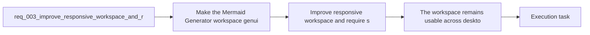

## item_004_improve_responsive_workspace_and_require_shift_for_preview_zoom - Improve responsive workspace and require shift for preview zoom
> From version: 0.1.0
> Schema version: 1.0
> Status: Done
> Understanding: 97%
> Confidence: 94%
> Progress: 100%
> Complexity: Medium
> Theme: UI
> Reminder: Update status/understanding/confidence/progress and linked task references when you edit this doc.

# Problem
- Make the Mermaid Generator workspace genuinely responsive across desktop, tablet, and mobile widths.
- Keep the preview navigation predictable by allowing wheel-based zoom only while the `Shift` key is actively pressed.
- Prevent accidental zoom interactions during ordinary page or panel scrolling inside the app.
- The current workspace direction is correct at a product level, but two concrete interaction rules still need to be locked down.
- First, the app must remain usable on smaller viewports instead of only working on a large desktop canvas. The product brief already states that desktop remains the priority, but the app still needs a coherent responsive behavior for tablet and mobile.

# Scope
- In:
- Refine the workspace layout so it stays usable across desktop, tablet, and mobile widths.
- Preserve preview-first hierarchy on large screens while adapting panel order and sizing on smaller screens.
- Ensure the editor, prompt, preview, and `Settings` entry point remain reachable without overlap or unusable clipping.
- Restrict wheel-based preview zoom to interactions where the pointer is over the preview and `Shift` is pressed.
- Keep explicit preview zoom controls available without the `Shift` modifier.
- Out:
- Replacing the MVP workspace information architecture with a different product layout.
- Redesigning the prompt, settings, or export feature scope beyond responsive and zoom-interaction fixes.
- Introducing gesture-heavy navigation patterns beyond the current pan and toolbar controls.

# Acceptance criteria
- The workspace remains usable across desktop, tablet, and mobile widths, with no critical panel clipping, unusable controls, or broken layout hierarchy.
- On large screens, the preview remains the dominant area while the editor and prompt keep a coherent secondary placement.
- On smaller viewports, the layout adapts so the editor, prompt, preview, and `Settings` entry point remain reachable without overlap or unusable truncation.
- Wheel-based preview zoom only activates when the pointer is over the preview and the `Shift` key is pressed.
- Without `Shift`, wheel or trackpad scrolling does not trigger preview zoom and preserves normal scrolling behavior.

# AC Traceability
- AC1 -> Scope: The workspace remains usable across desktop, tablet, and mobile widths, with no critical panel clipping, unusable controls, or broken layout hierarchy. Proof: responsive viewport validation covers large, medium, and small breakpoints.
- AC2 -> Scope: On large screens, the preview remains the dominant area while the editor and prompt keep a coherent secondary placement. Proof: desktop UI validation confirms preview-first hierarchy and secondary left-rail placement.
- AC3 -> Scope: On smaller viewports, the layout adapts so the editor, prompt, preview, and `Settings` entry point remain reachable without overlap or unusable truncation. Proof: tablet and mobile UI validation confirms access to core panels and settings entry point.
- AC4 -> Scope: Wheel-based preview zoom only activates when the pointer is over the preview and the `Shift` key is pressed. Proof: interaction validation checks that wheel zoom changes preview scale only under the modifier-gated path.
- AC5 -> Scope: Without `Shift`, wheel or trackpad scrolling does not trigger preview zoom and preserves normal scrolling behavior. Proof: interaction validation checks that ordinary wheel input preserves normal scrolling and leaves preview scale unchanged.

# Decision framing
- Product framing: Required
- Product signals: navigation and discoverability, experience scope
- Product follow-up: Create or link a product brief before implementation moves deeper into delivery.
- Architecture framing: Consider
- Architecture signals: data model and persistence
- Architecture follow-up: Review whether an architecture decision is needed before implementation becomes harder to reverse.

# Links
- Product brief(s): `prod_000_mermaid_generator_product_direction`
- Architecture decision(s): `adr_000_choose_a_static_pwa_architecture_for_mermaid_generator`
- Request: `req_003_improve_responsive_workspace_and_require_shift_for_preview_zoom`
- Primary task(s): `task_000_orchestrate_mermaid_generator_mvp_delivery`, `task_001_improve_responsive_workspace_and_require_shift_for_preview_zoom`

# AI Context
- Summary: Tighten the Mermaid Generator workspace so it behaves responsively across viewports and only zooms the preview on wheel...
- Keywords: responsive, layout, mobile, tablet, desktop, preview, zoom, shift, wheel, interaction
- Use when: Use when defining responsive behavior and safer preview navigation rules for the main Mermaid workspace.
- Skip when: Skip when the work concerns OpenAI settings, export formats, or release workflow documentation.

# References
- `logics/product/prod_000_mermaid_generator_product_direction.md`
- `logics/architecture/adr_000_choose_a_static_pwa_architecture_for_mermaid_generator.md`
- `logics/tasks/task_000_orchestrate_mermaid_generator_mvp_delivery.md`
- `logics/skills/logics-ui-steering/SKILL.md`

# Priority
- Impact: High
- Urgency: High

# Notes
- Derived from request `req_003_improve_responsive_workspace_and_require_shift_for_preview_zoom`.
- Source file: `logics/request/req_003_improve_responsive_workspace_and_require_shift_for_preview_zoom.md`.
- Request context seeded into this backlog item from `logics/request/req_003_improve_responsive_workspace_and_require_shift_for_preview_zoom.md`.
- Completed in `task_001_improve_responsive_workspace_and_require_shift_for_preview_zoom` with responsive workspace refinements, preview-first mobile ordering, and `Shift`-gated wheel zoom.
