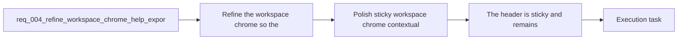

## item_005_polish_sticky_workspace_chrome_contextual_help_and_footer - Polish sticky workspace chrome contextual help and footer
> From version: 0.1.0
> Schema version: 1.0
> Status: Ready
> Understanding: 99%
> Confidence: 96%
> Progress: 0%
> Complexity: Medium
> Theme: UI
> Reminder: Update status/understanding/confidence/progress and linked task references when you edit this doc.

# Problem
- Make the workspace chrome feel calmer, more intentional, and easier to scan without reducing discoverability.
- Keep the header visible while the rest of the workspace scrolls under it.
- Replace always-visible helper text with reusable help icons and tooltips/popovers.
- Clean up noisy header and settings copy, then add a discreet footer signature that can later link to GitHub.
- Keep the resulting shell polish compatible with mobile and smaller touch viewports.

# Scope
- In:
  - sticky header behavior in normal workspace mode
  - reusable `(i)` help affordances for `Mermaid source`, `Prompt draft`, and `Preview`
  - stronger product copy under the app name
  - removal of `Prompt locked` and masked API-key status from the header
  - removal of `The MVP stores your OpenAI key locally on this device.` from settings
  - discreet footer with app name, copyright, and future repository-link slot
  - responsive/mobile-safe behavior for header, tooltips, and footer
- Out:
  - `Focus preview` layout bug fixes
  - editor typing-focus bug fixes
  - export modal behavior
  - prompt-generation shape guardrails

# Acceptance criteria
- The header is sticky and remains visible while the rest of the page scrolls underneath it.
- The helper sentences for `Mermaid source`, `Prompt draft`, and `Preview` are moved into help tooltips triggered from visible `(i)` icons near the relevant section labels.
- The header no longer shows `Prompt locked` or the masked OpenAI key state.
- The settings modal no longer shows the sentence `The MVP stores your OpenAI key locally on this device.`
- The marketing line under the app name is replaced by stronger product-facing copy.
- A discreet footer shows the app name and copyright and is structured to link to the GitHub repository once the repository URL is available.
- The refined workspace chrome remains usable on mobile and smaller touch viewports, including access to sticky header controls, contextual help, export, and footer affordances.

# AC Traceability
- AC1 -> Scope: The header is sticky and remains visible while the rest of the page scrolls underneath it.. Proof: browser validation and task report evidence.
- AC2 -> Scope: The helper sentences for `Mermaid source`, `Prompt draft`, and `Preview` are moved into help tooltips triggered from visible `(i)` icons near the relevant section labels.. Proof: UI checks and task report evidence.
- AC3 -> Scope: The header no longer shows `Prompt locked` or the masked OpenAI key state.. Proof: UI checks and task report evidence.
- AC4 -> Scope: The settings modal no longer shows the sentence `The MVP stores your OpenAI key locally on this device.`. Proof: settings UI checks and task report evidence.
- AC5 -> Scope: The marketing line under the app name is replaced by stronger product-facing copy.. Proof: UI checks and task report evidence.
- AC6 -> Scope: A discreet footer shows the app name and copyright and is structured to link to the GitHub repository once the repository URL is available.. Proof: UI checks and task report evidence.
- AC7 -> Scope: The refined workspace chrome remains usable on mobile and smaller touch viewports, including access to sticky header controls, contextual help, export, and footer affordances.. Proof: responsive browser validation and task report evidence.

# Decision framing
- Product framing: Consider
- Product signals: experience scope
- Product follow-up: Review whether a product brief is needed before scope becomes harder to change.
- Architecture framing: Required
- Architecture signals: data model and persistence, contracts and integration, delivery and operations
- Architecture follow-up: Create or link an architecture decision before irreversible implementation work starts.

# Links
- Product brief(s): `prod_000_mermaid_generator_product_direction`
- Architecture decision(s): `adr_000_choose_a_static_pwa_architecture_for_mermaid_generator`
- Request: `req_004_refine_workspace_chrome_help_export_footer_and_preview_focus_behavior`
- Primary task(s): `task_002_orchestrate_workspace_polish_onboarding_and_multi_provider_rollout`

# AI Context
- Summary: Refine the Mermaid Generator workspace chrome with a sticky header, tooltip help affordances, a fixed focus-preview mode, a...
- Keywords: sticky header, tooltip, help icon, focus preview, export modal, footer, marketing copy, prompt generation, ratio, mermaid
- Use when: Use when defining the next UI polish slice for the main Mermaid workspace shell and its related generation and export behaviors.
- Skip when: Skip when the work concerns release workflow, deployment setup, or unrelated provider integration.

# References
- `logics/product/prod_000_mermaid_generator_product_direction.md`
- `logics/architecture/adr_000_choose_a_static_pwa_architecture_for_mermaid_generator.md`
- `logics/tasks/task_001_improve_responsive_workspace_and_require_shift_for_preview_zoom.md`
- `logics/skills/logics-ui-steering/SKILL.md`

# Priority
- Impact: High
- Urgency: Medium

# Notes
- Derived from request `req_004_refine_workspace_chrome_help_export_footer_and_preview_focus_behavior`.
- Source file: `logics/request/req_004_refine_workspace_chrome_help_export_footer_and_preview_focus_behavior.md`.
- Request context seeded into this backlog item from `logics/request/req_004_refine_workspace_chrome_help_export_footer_and_preview_focus_behavior.md`.
