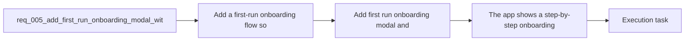

## item_006_add_first_run_onboarding_modal_and_settings_reactivation - Add first run onboarding modal and settings reactivation
> From version: 0.1.0
> Schema version: 1.0
> Status: Done
> Understanding: 100%
> Confidence: 98%
> Progress: 100%
> Complexity: Medium
> Theme: UI
> Reminder: Update status/understanding/confidence/progress and linked task references when you edit this doc.

# Problem
- Add a first-run onboarding flow so new users understand how to use Mermaid Generator without guessing the workspace.
- Use a modal-based, step-by-step onboarding similar in spirit to the one already used in `e-plan editor`.
- Let users dismiss onboarding and reactivate it later from `Settings`.
- Keep the onboarding lightweight, product-focused, and usable on mobile as well as desktop.

# Scope
- In:
  - first-run modal onboarding flow
  - exactly five MVP steps: welcome, code editor, prompt, preview, export
  - `Skip` from the start and `Finish` on the last step
  - local browser persistence for dismissed/completed onboarding
  - `Settings` action to reopen onboarding
  - mobile-safe layout and copy density
- Out:
  - coach marks anchored to every control in the workspace
  - advanced analytics or onboarding A/B testing
  - onboarding content for future features not yet present in the app

# Acceptance criteria
- The app shows a step-by-step onboarding modal for first-time users.
- The onboarding contains exactly five core steps for the MVP: welcome, code editor, prompt, preview, and export.
- The final onboarding step ends with a `Finish` action that closes the onboarding.
- The user can dismiss or hide onboarding and that choice is remembered locally in the browser.
- The app exposes a way from `Settings` to reopen onboarding after it has been dismissed.
- The onboarding content stays aligned with the actual workspace behavior and does not describe unavailable features.
- The onboarding remains usable on mobile and smaller viewports.
- The onboarding direction stays aligned with the product inspiration from `e-plan editor` without requiring a visual clone.

# AC Traceability
- AC1 -> Scope: The app shows a step-by-step onboarding modal for first-time users.. Proof: UI checks and task report evidence.
- AC2 -> Scope: The onboarding contains exactly five core steps for the MVP: welcome, code editor, prompt, preview, and export.. Proof: UI checks and task report evidence.
- AC3 -> Scope: The final onboarding step ends with a `Finish` action that closes the onboarding.. Proof: UI checks and task report evidence.
- AC4 -> Scope: The user can dismiss or hide onboarding and that choice is remembered locally in the browser.. Proof: persistence checks and task report evidence.
- AC5 -> Scope: The app exposes a way from `Settings` to reopen onboarding after it has been dismissed.. Proof: settings UI checks and task report evidence.
- AC6 -> Scope: The onboarding content stays aligned with the actual workspace behavior and does not describe unavailable features.. Proof: content review and task report evidence.
- AC7 -> Scope: The onboarding remains usable on mobile and smaller viewports.. Proof: responsive browser validation and task report evidence.
- AC8 -> Scope: The onboarding direction stays aligned with the product inspiration from `e-plan editor` without requiring a visual clone.. Proof: UI review and task report evidence.

# Decision framing
- Product framing: Required
- Product signals: conversion journey, pricing and packaging, navigation and discoverability, experience scope
- Product follow-up: Create or link a product brief before implementation moves deeper into delivery.
- Architecture framing: Required
- Architecture signals: data model and persistence, contracts and integration
- Architecture follow-up: Create or link an architecture decision before irreversible implementation work starts.

# Links
- Product brief(s): `prod_000_mermaid_generator_product_direction`
- Architecture decision(s): `adr_000_choose_a_static_pwa_architecture_for_mermaid_generator`
- Request: `req_005_add_first_run_onboarding_modal_with_reactivation_from_settings`
- Primary task(s): `task_002_orchestrate_workspace_polish_onboarding_and_multi_provider_rollout`

# AI Context
- Summary: Add a first-run onboarding modal flow that explains the Mermaid Generator workspace step by step, persists dismissal locally...
- Keywords: onboarding, first run, modal, wizard, settings, local persistence, welcome, editor, prompt, preview, export
- Use when: Use when defining first-use guidance and reactivation behavior for the Mermaid Generator workspace.
- Skip when: Skip when the work concerns export implementation details, sticky-header polish, or provider configuration alone.

# References
- `logics/product/prod_000_mermaid_generator_product_direction.md`
- `logics/architecture/adr_000_choose_a_static_pwa_architecture_for_mermaid_generator.md`
- `https://e-plan-editor.onrender.com/`
- `https://github.com/AlexAgo83/electrical-plan-editor`
- `logics/skills/logics-ui-steering/SKILL.md`

# Priority
- Impact: Medium
- Urgency: Medium

# Notes
- Derived from request `req_005_add_first_run_onboarding_modal_with_reactivation_from_settings`.
- Source file: `logics/request/req_005_add_first_run_onboarding_modal_with_reactivation_from_settings.md`.
- Request context seeded into this backlog item from `logics/request/req_005_add_first_run_onboarding_modal_with_reactivation_from_settings.md`.
