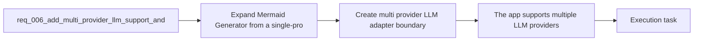

## item_007_create_multi_provider_llm_adapter_boundary - Create multi provider LLM adapter boundary
> From version: 0.1.0
> Schema version: 1.0
> Status: Done
> Understanding: 100%
> Confidence: 97%
> Progress: 100%
> Complexity: Medium
> Theme: UI
> Reminder: Update status/understanding/confidence/progress and linked task references when you edit this doc.

# Problem
- Replace the current OpenAI-specific generation path with a provider boundary that can support several LLM vendors cleanly.
- Normalize the app-facing generation contract so UI and prompt flows stop depending on provider-specific request shapes.
- Keep the design compatible with the browser-first BYOK model and future provider additions.

# Scope
- In:
  - provider registry, shared types, and normalized generate-diagram contract
  - adapter boundary that routes generation requests to provider-specific implementations
  - migration of the current OpenAI path to the shared boundary
  - local persistence structures that can represent multiple saved providers and one active provider
- Out:
  - end-user settings UI for provider selection and key entry
  - enabling several live providers in the prompt flow
  - advanced per-provider model selection controls

# Acceptance criteria
- The app supports multiple LLM providers through a provider abstraction instead of a single OpenAI-only integration path.
- The current OpenAI path runs through that provider abstraction instead of a direct one-off integration.
- The local persistence model remains browser-first and compatible with the current static architecture.
- The app-facing generation contract stays normalized even if provider-specific request logic differs internally.
- The request stays aligned with the existing static architecture ADR and product direction for provider flexibility.

# AC Traceability
- AC1 -> Scope: The app supports multiple LLM providers through a provider abstraction instead of a single OpenAI-only integration path.. Proof: code-path checks and task report evidence.
- AC2 -> Scope: The current OpenAI path runs through that provider abstraction instead of a direct one-off integration.. Proof: automated tests and task report evidence.
- AC3 -> Scope: The local persistence model remains browser-first and compatible with the current static architecture.. Proof: code review and task report evidence.
- AC4 -> Scope: The app-facing generation contract stays normalized even if provider-specific request logic differs internally.. Proof: adapter tests and task report evidence.
- AC5 -> Scope: The request stays aligned with the existing static architecture ADR and product direction for provider flexibility.. Proof: linked-doc review and task report evidence.

# Decision framing
- Product framing: Consider
- Product signals: experience scope
- Product follow-up: Review whether a product brief is needed before scope becomes harder to change.
- Architecture framing: Required
- Architecture signals: data model and persistence, contracts and integration, runtime and boundaries
- Architecture follow-up: Create or link an architecture decision before irreversible implementation work starts.

# Links
- Product brief(s): `prod_000_mermaid_generator_product_direction`
- Architecture decision(s): `adr_000_choose_a_static_pwa_architecture_for_mermaid_generator`
- Request: `req_006_add_multi_provider_llm_support_and_expand_settings_management`
- Primary task(s): `task_002_orchestrate_workspace_polish_onboarding_and_multi_provider_rollout`

# AI Context
- Summary: Expand Mermaid Generator to support multiple LLM providers and evolve Settings into a provider-management surface while keeping the...
- Keywords: llm, provider, multi-provider, settings, byok, local persistence, openai, anthropic, gemini, mistral, groq, together, openrouter
- Use when: Use when defining provider abstraction, settings evolution, and local provider-key management for prompt generation.
- Skip when: Skip when the work concerns Mermaid editing, export UX, or non-LLM workspace polish alone.

# References
- `logics/request/req_002_add_local_openai_key_setup_and_settings_entry_point.md`
- `logics/product/prod_000_mermaid_generator_product_direction.md`
- `logics/architecture/adr_000_choose_a_static_pwa_architecture_for_mermaid_generator.md`
- `logics/skills/logics-ui-steering/SKILL.md`

# Priority
- Impact: High
- Urgency: Medium

# Notes
- Derived from request `req_006_add_multi_provider_llm_support_and_expand_settings_management`.
- Source file: `logics/request/req_006_add_multi_provider_llm_support_and_expand_settings_management.md`.
- Request context seeded into this backlog item from `logics/request/req_006_add_multi_provider_llm_support_and_expand_settings_management.md`.
