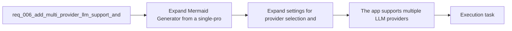

## item_008_expand_settings_for_provider_selection_and_local_keys - Expand settings for provider selection and local keys
> From version: 0.1.0
> Schema version: 1.0
> Status: Ready
> Understanding: 99%
> Confidence: 96%
> Progress: 0%
> Complexity: Medium
> Theme: UI
> Reminder: Update status/understanding/confidence/progress and linked task references when you edit this doc.

# Problem
- Evolve `Settings` from a single-key screen into a small provider-management surface.
- Let users save multiple provider keys locally, switch the active provider, and keep the UX understandable on mobile.
- Preserve the browser-first BYOK model without turning Settings into a full preference center yet.

# Scope
- In:
  - provider picker in `Settings`
  - local create, update, reveal/hide, and remove flows for provider-specific keys
  - active-provider selection with one active provider at a time
  - mobile-safe settings layout and messaging
  - prompt availability/gating tied to the active provider having a usable key
- Out:
  - implementing every provider backend adapter
  - advanced model configuration or provider-specific tuning controls
  - managed server-side secrets

# Acceptance criteria
- `Settings` lets the user select a provider and manage the provider-specific API key locally in the browser.
- The app can store multiple provider keys locally while keeping only one active provider for generation at a time.
- The local persistence model remains browser-first and compatible with the current static architecture.
- The provider-management UX remains usable on mobile and smaller viewports.
- The prompt-generation surface remains unavailable or clearly gated when the active provider has no configured key.
- The request stays aligned with the existing static architecture ADR and product direction for provider flexibility.

# AC Traceability
- AC1 -> Scope: `Settings` lets the user select a provider and manage the provider-specific API key locally in the browser.. Proof: settings UI checks and task report evidence.
- AC2 -> Scope: The app can store multiple provider keys locally while keeping only one active provider for generation at a time.. Proof: persistence checks and task report evidence.
- AC3 -> Scope: The local persistence model remains browser-first and compatible with the current static architecture.. Proof: code review and task report evidence.
- AC4 -> Scope: The provider-management UX remains usable on mobile and smaller viewports.. Proof: responsive browser validation and task report evidence.
- AC5 -> Scope: The prompt-generation surface remains unavailable or clearly gated when the active provider has no configured key.. Proof: UI state checks and task report evidence.
- AC6 -> Scope: The request stays aligned with the existing static architecture ADR and product direction for provider flexibility.. Proof: linked-doc review and task report evidence.

# Decision framing
- Product framing: Required
- Product signals: experience scope
- Product follow-up: Create or link a product brief before implementation moves deeper into delivery.
- Architecture framing: Required
- Architecture signals: data model and persistence, contracts and integration, runtime and boundaries
- Architecture follow-up: Create or link an architecture decision before irreversible implementation work starts.

# Links
- Product brief(s): `prod_000_mermaid_generator_product_direction`
- Architecture decision(s): `adr_000_choose_a_static_pwa_architecture_for_mermaid_generator`
- Request: `req_006_add_multi_provider_llm_support_and_expand_settings_management`
- Primary task(s): `task_002_orchestrate_workspace_polish_onboarding_and_multi_provider_rollout`

# AI Context
- Summary: Expand Mermaid Generator to support multiple LLM providers and evolve Settings into a provider-management surface while keeping the...
- Keywords: llm, provider, multi-provider, settings, byok, local persistence, openai, anthropic, gemini, mistral, groq, together, openrouter
- Use when: Use when defining provider abstraction, settings evolution, and local provider-key management for prompt generation.
- Skip when: Skip when the work concerns Mermaid editing, export UX, or non-LLM workspace polish alone.

# References
- `logics/request/req_002_add_local_openai_key_setup_and_settings_entry_point.md`
- `logics/product/prod_000_mermaid_generator_product_direction.md`
- `logics/architecture/adr_000_choose_a_static_pwa_architecture_for_mermaid_generator.md`
- `logics/skills/logics-ui-steering/SKILL.md`

# Priority
- Impact: High
- Urgency: Medium

# Notes
- Derived from request `req_006_add_multi_provider_llm_support_and_expand_settings_management`.
- Source file: `logics/request/req_006_add_multi_provider_llm_support_and_expand_settings_management.md`.
- Request context seeded into this backlog item from `logics/request/req_006_add_multi_provider_llm_support_and_expand_settings_management.md`.
