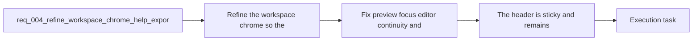

## item_009_fix_preview_focus_editor_continuity_and_export_modal_flow - Fix preview focus editor continuity and export modal flow
> From version: 0.1.0
> Schema version: 1.0
> Status: Ready
> Understanding: 99%
> Confidence: 96%
> Progress: 0%
> Complexity: Medium
> Theme: UI
> Reminder: Update status/understanding/confidence/progress and linked task references when you edit this doc.

# Problem
- Fix the editing and preview issues that currently break the main authoring flow.
- The Mermaid source editor must keep focus during continuous manual typing.
- `Focus preview` must actually use the full available app width.
- Export should move from two inline actions to one entry point with an export options modal.
- The resulting behavior must stay usable on mobile and be validated in a real browser flow.

# Scope
- In:
  - fix for Mermaid source editor losing focus after the first typed character
  - fix for `Focus preview` leaving empty space instead of expanding the preview area
  - single export button opening an export modal
  - MVP export options including at least format and raster size/scale
  - browser validation with Playwright for the corrected preview/export flow
  - mobile-safe behavior for focus mode and export access
- Out:
  - sticky header and tooltip chrome polish
  - footer/copy cleanup outside the affected flows
  - prompt-generation shape guardrails

# Acceptance criteria
- The Mermaid source editor no longer loses focus after the first typed character during manual editing.
- `Focus preview` uses the available width correctly and does not leave empty dead space on the side in the focused state.
- `Export SVG` and `Export PNG` are replaced by a single export action that opens a modal for export options including at least format and size.
- The refined workspace chrome remains usable on mobile and smaller touch viewports, including access to sticky header controls, contextual help, export, and footer affordances.
- The `Focus preview` bug and the final UI behavior are validated in a real browser flow, not only through static code inspection.

# AC Traceability
- AC1 -> Scope: The Mermaid source editor no longer loses focus after the first typed character during manual editing.. Proof: browser validation and task report evidence.
- AC2 -> Scope: `Focus preview` uses the available width correctly and does not leave empty dead space on the side in the focused state.. Proof: browser validation and task report evidence.
- AC3 -> Scope: `Export SVG` and `Export PNG` are replaced by a single export action that opens a modal for export options including at least format and size.. Proof: UI checks and task report evidence.
- AC4 -> Scope: The refined workspace flow remains usable on mobile and smaller touch viewports, including access to focus mode and export affordances.. Proof: responsive browser validation and task report evidence.
- AC5 -> Scope: The `Focus preview` bug and the final UI behavior are validated in a real browser flow, not only through static code inspection.. Proof: Playwright checks and task report evidence.

# Decision framing
- Product framing: Consider
- Product signals: experience scope
- Product follow-up: Review whether a product brief is needed before scope becomes harder to change.
- Architecture framing: Required
- Architecture signals: data model and persistence, contracts and integration, delivery and operations
- Architecture follow-up: Create or link an architecture decision before irreversible implementation work starts.

# Links
- Product brief(s): `prod_000_mermaid_generator_product_direction`
- Architecture decision(s): `adr_000_choose_a_static_pwa_architecture_for_mermaid_generator`
- Request: `req_004_refine_workspace_chrome_help_export_footer_and_preview_focus_behavior`
- Primary task(s): `task_002_orchestrate_workspace_polish_onboarding_and_multi_provider_rollout`

# AI Context
- Summary: Refine the Mermaid Generator workspace chrome with a sticky header, tooltip help affordances, a fixed focus-preview mode, a...
- Keywords: sticky header, tooltip, help icon, focus preview, export modal, footer, marketing copy, prompt generation, ratio, mermaid
- Use when: Use when defining the next UI polish slice for the main Mermaid workspace shell and its related generation and export behaviors.
- Skip when: Skip when the work concerns release workflow, deployment setup, or unrelated provider integration.

# References
- `logics/product/prod_000_mermaid_generator_product_direction.md`
- `logics/architecture/adr_000_choose_a_static_pwa_architecture_for_mermaid_generator.md`
- `logics/tasks/task_001_improve_responsive_workspace_and_require_shift_for_preview_zoom.md`
- `logics/skills/logics-ui-steering/SKILL.md`

# Priority
- Impact: High
- Urgency: High

# Notes
- Derived from request `req_004_refine_workspace_chrome_help_export_footer_and_preview_focus_behavior`.
- Source file: `logics/request/req_004_refine_workspace_chrome_help_export_footer_and_preview_focus_behavior.md`.
- Request context seeded into this backlog item from `logics/request/req_004_refine_workspace_chrome_help_export_footer_and_preview_focus_behavior.md`.
