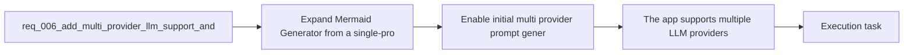

## item_010_enable_initial_multi_provider_prompt_generation_rollout - Enable initial multi provider prompt generation rollout
> From version: 0.1.0
> Schema version: 1.0
> Status: Done
> Understanding: 100%
> Confidence: 97%
> Progress: 100%
> Complexity: Medium
> Theme: UI
> Reminder: Update status/understanding/confidence/progress and linked task references when you edit this doc.

# Problem
- Enable the first real multi-provider generation rollout on top of the new adapter boundary and settings model.
- Keep the user-facing prompt-to-Mermaid flow stable while supporting more than one live provider.
- Start with a smaller enabled provider set instead of implementing the full candidate list at once.

# Scope
- In:
  - enable an initial provider set for live generation, prioritized around `OpenAI`, `OpenRouter`, and `Anthropic`
  - route prompt generation through the selected active provider
  - normalize provider-specific response and error handling for the existing prompt workflow
  - keep model selection hidden by default unless a provider path clearly requires exposure
  - retain browser-first BYOK behavior for all enabled providers
- Out:
  - enabling the full long-list provider catalog on day one
  - managed/shared credentials
  - advanced provider comparison or benchmarking UI

# Acceptance criteria
- The app supports multiple LLM providers through a provider abstraction instead of a single OpenAI-only integration path.
- `Settings` lets the user select a provider and manage the provider-specific API key locally in the browser.
- The prompt-generation flow uses the currently selected provider without changing the core app workflow.
- The local persistence model remains browser-first and compatible with the current static architecture.
- The provider-management UX remains usable on mobile and smaller viewports.
- The app-facing generation contract stays normalized even if provider-specific request logic differs internally.
- The first rollout can stay limited to the prioritized initial provider set instead of all candidate providers.

# AC Traceability
- AC1 -> Scope: The app supports multiple LLM providers through a provider abstraction instead of a single OpenAI-only integration path.. Proof: automated tests and task report evidence.
- AC2 -> Scope: `Settings` lets the user select a provider and manage the provider-specific API key locally in the browser.. Proof: settings UI checks and task report evidence.
- AC3 -> Scope: The prompt-generation flow uses the currently selected provider without changing the core app workflow.. Proof: generation-flow checks and task report evidence.
- AC4 -> Scope: The local persistence model remains browser-first and compatible with the current static architecture.. Proof: code review and task report evidence.
- AC5 -> Scope: The provider-management UX remains usable on mobile and smaller viewports.. Proof: responsive browser validation and task report evidence.
- AC6 -> Scope: The app-facing generation contract stays normalized even if provider-specific request logic differs internally.. Proof: adapter tests and task report evidence.
- AC7 -> Scope: The first rollout can stay limited to the prioritized initial provider set instead of all candidate providers.. Proof: release-scope review and task report evidence.

# Decision framing
- Product framing: Consider
- Product signals: experience scope
- Product follow-up: Review whether a product brief is needed before scope becomes harder to change.
- Architecture framing: Required
- Architecture signals: data model and persistence, contracts and integration, runtime and boundaries
- Architecture follow-up: Create or link an architecture decision before irreversible implementation work starts.

# Links
- Product brief(s): `prod_000_mermaid_generator_product_direction`
- Architecture decision(s): `adr_000_choose_a_static_pwa_architecture_for_mermaid_generator`
- Request: `req_006_add_multi_provider_llm_support_and_expand_settings_management`
- Primary task(s): `task_002_orchestrate_workspace_polish_onboarding_and_multi_provider_rollout`

# AI Context
- Summary: Expand Mermaid Generator to support multiple LLM providers and evolve Settings into a provider-management surface while keeping the...
- Keywords: llm, provider, multi-provider, settings, byok, local persistence, openai, anthropic, gemini, mistral, groq, together, openrouter
- Use when: Use when defining provider abstraction, settings evolution, and local provider-key management for prompt generation.
- Skip when: Skip when the work concerns Mermaid editing, export UX, or non-LLM workspace polish alone.

# References
- `logics/request/req_002_add_local_openai_key_setup_and_settings_entry_point.md`
- `logics/product/prod_000_mermaid_generator_product_direction.md`
- `logics/architecture/adr_000_choose_a_static_pwa_architecture_for_mermaid_generator.md`
- `logics/skills/logics-ui-steering/SKILL.md`

# Priority
- Impact: High
- Urgency: Medium

# Notes
- Derived from request `req_006_add_multi_provider_llm_support_and_expand_settings_management`.
- Source file: `logics/request/req_006_add_multi_provider_llm_support_and_expand_settings_management.md`.
- Request context seeded into this backlog item from `logics/request/req_006_add_multi_provider_llm_support_and_expand_settings_management.md`.
