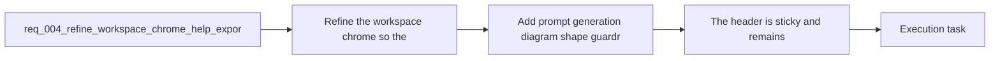

## item_011_add_prompt_generation_diagram_shape_guardrails - Add prompt generation diagram shape guardrails

> From version: 0.1.0
> Schema version: 1.0
> Status: Done
> Understanding: 100%
> Confidence: 97%
> Progress: 100%
> Complexity: Medium
> Theme: UI
> Reminder: Update status/understanding/confidence/progress and linked task references when you edit this doc.

# Problem

- Prompt-based generation can currently produce diagrams with extreme width or height, which reduces preview and export usefulness.
- The generation flow needs lightweight guardrails so output stays closer to the intended workspace shape without adding a heavy regeneration loop.
- The result should remain browser-first and compatible with the current static architecture.

# Scope

- In:
  - prompt/system guidance that encourages balanced Mermaid layouts
  - light client-side heuristics or validation to discourage unnecessarily extreme diagram ratios
  - stable product-level shape bias rather than device-specific viewport coupling
  - user messaging or fallback behavior when generated output is too extreme
- Out:
  - major workspace chrome changes
  - export modal work
  - provider abstraction and settings work
  - complex automatic regenerate-until-perfect loops

# Acceptance criteria

- Prompt-based generation includes guardrails so generated Mermaid diagrams avoid becoming unnecessarily extreme in width or height when a more balanced layout is possible.
- The guardrails use prompt instructions and/or light browser-side heuristics instead of a heavy automatic regeneration loop.
- The generation bias stays stable at product level and does not depend only on the current live viewport dimensions.
- The prompt-to-Mermaid workflow remains compatible with the current browser-first static architecture.

# AC Traceability

- AC1 -> Scope: Prompt-based generation includes guardrails so generated Mermaid diagrams avoid becoming unnecessarily extreme in width or height when a more balanced layout is possible.. Proof: representative generation checks and task report evidence.
- AC2 -> Scope: The guardrails use prompt instructions and/or light browser-side heuristics instead of a heavy automatic regeneration loop.. Proof: implementation review and task report evidence.
- AC3 -> Scope: The generation bias stays stable at product level and does not depend only on the current live viewport dimensions.. Proof: prompt/config review and task report evidence.
- AC4 -> Scope: The prompt-to-Mermaid workflow remains compatible with the current browser-first static architecture.. Proof: integration checks and task report evidence.

# Decision framing

- Product framing: Consider
- Product signals: experience scope
- Product follow-up: Review whether a product brief is needed before scope becomes harder to change.
- Architecture framing: Required
- Architecture signals: data model and persistence, contracts and integration, delivery and operations
- Architecture follow-up: Create or link an architecture decision before irreversible implementation work starts.

# Links

- Product brief(s): `prod_000_mermaid_generator_product_direction`
- Architecture decision(s): `adr_000_choose_a_static_pwa_architecture_for_mermaid_generator`
- Request: `req_004_refine_workspace_chrome_help_export_footer_and_preview_focus_behavior`
- Primary task(s): `task_002_orchestrate_workspace_polish_onboarding_and_multi_provider_rollout`

# AI Context

- Summary: Refine the Mermaid Generator workspace chrome with a sticky header, tooltip help affordances, a fixed focus-preview mode, a...
- Keywords: sticky header, tooltip, help icon, focus preview, export modal, footer, marketing copy, prompt generation, ratio, mermaid
- Use when: Use when defining the next UI polish slice for the main Mermaid workspace shell and its related generation and export behaviors.
- Skip when: Skip when the work concerns release workflow, deployment setup, or unrelated provider integration.

# References

- `logics/product/prod_000_mermaid_generator_product_direction.md`
- `logics/architecture/adr_000_choose_a_static_pwa_architecture_for_mermaid_generator.md`
- `logics/tasks/task_001_improve_responsive_workspace_and_require_shift_for_preview_zoom.md`
- `logics/skills/logics-ui-steering/SKILL.md`

# Priority

- Impact: Medium
- Urgency: Medium

# Notes

- Derived from request `req_004_refine_workspace_chrome_help_export_footer_and_preview_focus_behavior`.
- Source file: `logics/request/req_004_refine_workspace_chrome_help_export_footer_and_preview_focus_behavior.md`.
- Request context seeded into this backlog item from `logics/request/req_004_refine_workspace_chrome_help_export_footer_and_preview_focus_behavior.md`.
