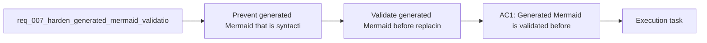

## item_012_validate_generated_mermaid_before_replacing_editor_source - Validate generated Mermaid before replacing editor source
> From version: 0.1.0
> Schema version: 1.0
> Status: Ready
> Understanding: 98%
> Confidence: 97%
> Progress: 0%
> Complexity: Medium
> Theme: UI
> Reminder: Update status/understanding/confidence/progress and linked task references when you edit this doc.

# Problem
- Prevent generated Mermaid that is syntactically invalid from degrading the main authoring experience.
- Stop exposing Mermaid's raw fallback error rendering to the user when generation returns invalid code.
- Add a safer generated-code validation step so the app can either repair a narrow class of issues or reject the generated output cleanly.
- Prompt generation can currently return Mermaid that looks plausible but is invalid for the Mermaid parser, especially around generated `subgraph` identifiers and follow-up `style` lines.
- When that happens, the preview may show Mermaid's own raw error rendering such as `Syntax error in text`, which leaks implementation detail and makes the product feel unstable.

# Scope
- In:
  - validate generated Mermaid before it replaces the current editor source
  - bounded normalization of generated syntax issues such as invalid `subgraph` identifiers and matching `style` targets
  - preserve the current editor source when generated Mermaid remains invalid
  - automated validation for the generated-code safeguard path
- Out:
  - broad rewriting of Mermaid written manually by the user
  - major UI shell redesign outside the generated Mermaid path

# Acceptance criteria
- AC1: Generated Mermaid is validated before it replaces the current authoring source in the editor.
- AC2: Mermaid-native raw fallback visuals such as `Syntax error in text` are not shown as the end-user preview state.
- AC3: The app can automatically normalize a bounded class of generated syntax issues, including invalid generated `subgraph` identifiers referenced by styling lines.
- AC4: If generated Mermaid remains invalid after lightweight normalization, the app keeps the current source stable and shows a clear app-owned error state instead of silently swapping in broken code.
- AC5: Manual Mermaid editing is not silently rewritten by this safeguard path; the hardening applies to generated code unless an explicit manual-fix flow is introduced later.
- AC6: The validation and fallback behavior is covered by automated tests.

# AC Traceability
- AC1 -> Scope: Generated Mermaid is validated before it replaces the current authoring source in the editor.. Proof: generated-output validation checks and targeted tests.
- AC2 -> Scope: Mermaid-native raw fallback visuals such as `Syntax error in text` are not shown as the end-user preview state.. Proof: preview-state checks and browser validation.
- AC3 -> Scope: The app can automatically normalize a bounded class of generated syntax issues, including invalid generated `subgraph` identifiers referenced by styling lines.. Proof: normalization tests and representative generated examples.
- AC4 -> Scope: If generated Mermaid remains invalid after lightweight normalization, the app keeps the current source stable and shows a clear app-owned error state instead of silently swapping in broken code.. Proof: failure-path tests and browser validation.
- AC5 -> Scope: Manual Mermaid editing is not silently rewritten by this safeguard path; the hardening applies to generated code unless an explicit manual-fix flow is introduced later.. Proof: code-path review and manual-input regression checks.
- AC6 -> Scope: The validation and fallback behavior is covered by automated tests.. Proof: targeted unit and UI tests.

# Decision framing
- Product framing: Not needed
- Product signals: (none detected)
- Product follow-up: No product brief follow-up is expected based on current signals.
- Architecture framing: Required
- Architecture signals: data model and persistence, contracts and integration
- Architecture follow-up: Create or link an architecture decision before irreversible implementation work starts.

# Links
- Product brief(s): `prod_000_mermaid_generator_product_direction`
- Architecture decision(s): `adr_000_choose_a_static_pwa_architecture_for_mermaid_generator`
- Request: `req_007_harden_generated_mermaid_validation_and_error_handling`
- Primary task(s): `task_003_orchestrate_mermaid_hardening_and_compact_header_focus_delivery`

# AI Context
- Summary: Harden the generated Mermaid path so invalid generated diagrams are validated, lightly normalized when safe, and rejected through...
- Keywords: generated mermaid, validation, fallback, syntax error, subgraph id, normalization, preview error state, guardrail
- Use when: Use when the generated prompt-to-Mermaid flow can inject invalid Mermaid and the product needs safer validation, repair, and error handling.
- Skip when: Skip when the work is only about manual Mermaid authoring, visual polish, or unrelated provider setup.

# References
- `logics/request/req_004_refine_workspace_chrome_help_export_footer_and_preview_focus_behavior.md`
- `logics/request/req_006_add_multi_provider_llm_support_and_expand_settings_management.md`
- `logics/product/prod_000_mermaid_generator_product_direction.md`
- `logics/architecture/adr_000_choose_a_static_pwa_architecture_for_mermaid_generator.md`
- `src/lib/mermaid.ts`
- `src/App.tsx`
- `logics/skills/logics-ui-steering/SKILL.md`

# Priority
- Impact: High
- Urgency: High

# Notes
- Derived from request `req_007_harden_generated_mermaid_validation_and_error_handling`.
- Source file: `logics/request/req_007_harden_generated_mermaid_validation_and_error_handling.md`.
- Request context seeded into this backlog item from `logics/request/req_007_harden_generated_mermaid_validation_and_error_handling.md`.
