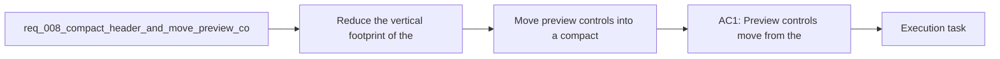

## item_013_move_preview_controls_into_a_compact_icon_based_header - Move preview controls into a compact icon based header

> From version: 0.1.0+wave3
> Schema version: 1.0
> Status: Done
> Understanding: 100%
> Confidence: 99%
> Progress: 100%
> Complexity: Medium
> Theme: UI
> Reminder: Update status/understanding/confidence/progress and linked task references when you edit this doc.

# Problem

- Reduce the vertical footprint of the current workspace header and preview area chrome.
- Move preview controls into the main header so navigation and actions live in one consistent shell location.
- Replace text-heavy preview controls with icon-based actions that remain understandable through hover or focus labels.
- Keep the resulting control model usable on mobile by collapsing header actions into a burger menu.
- The current preview toolbar still consumes too much height and duplicates application chrome beneath the header.
- The product should feel more compact and tool-like, with a tighter sticky header that owns the primary actions.

# Scope

- In:
  - move desktop preview controls into the sticky header
  - replace text-first controls with icon-first controls
  - hover and focus labels for each header action
  - materially reduce header height and spacing
- Out:
  - mobile burger navigation behavior
  - full-page focus-mode chrome removal

# Acceptance criteria

- AC1: Preview controls move from the preview panel into the main header.
- AC2: The moved controls are rendered as icon-based actions rather than text-first buttons.
- AC3: Each icon action exposes a clear text label on hover and keyboard focus so users can understand the control purpose.
- AC4: The header becomes materially more compact in height and spacing than the current implementation.
- AC5: On mobile, the moved preview controls and `Settings` are grouped into one burger menu instead of appearing as a row of separate header buttons.
- AC6: The resulting header and action model remain usable on desktop, tablet, and mobile.

# AC Traceability

- AC1 -> Scope: Preview controls move from the preview panel into the main header.. Proof: desktop UI checks and browser validation.
- AC2 -> Scope: The moved controls are rendered as icon-based actions rather than text-first buttons.. Proof: component review and browser validation.
- AC3 -> Scope: Each icon action exposes a clear text label on hover and keyboard focus so users can understand the control purpose.. Proof: tooltip and accessibility checks.
- AC4 -> Scope: The header becomes materially more compact in height and spacing than the current implementation.. Proof: visual comparison and responsive browser checks.
- AC5 -> Scope: On mobile, the moved preview controls and `Settings` are grouped into one burger menu instead of appearing as a row of separate header buttons.. Proof: mobile browser validation.
- AC6 -> Scope: The resulting header and action model remain usable on desktop, tablet, and mobile.. Proof: responsive interaction checks.

# Decision framing

- Product framing: Required
- Product signals: conversion journey, navigation and discoverability, experience scope
- Product follow-up: Create or link a product brief before implementation moves deeper into delivery.
- Architecture framing: Consider
- Architecture signals: data model and persistence
- Architecture follow-up: Review whether an architecture decision is needed before implementation becomes harder to reverse.

# Links

- Product brief(s): `prod_000_mermaid_generator_product_direction`
- Architecture decision(s): `adr_000_choose_a_static_pwa_architecture_for_mermaid_generator`
- Request: `req_008_compact_header_and_move_preview_controls_into_icon_based_navigation`
- Primary task(s): `task_003_orchestrate_mermaid_hardening_and_compact_header_focus_delivery`

# AI Context

- Summary: Refactor the shell so preview controls live in a much more compact header, use icon-based actions with explanatory...
- Keywords: compact header, preview controls, icons, tooltip labels, burger menu, mobile navigation, sticky header, shell refinement
- Use when: Use when the workspace header and preview controls need to be consolidated into a tighter, icon-led navigation model.
- Skip when: Skip when the work only changes Mermaid rendering, providers, onboarding content, or unrelated export logic.

# References

- `logics/request/req_004_refine_workspace_chrome_help_export_footer_and_preview_focus_behavior.md`
- `logics/product/prod_000_mermaid_generator_product_direction.md`
- `logics/architecture/adr_000_choose_a_static_pwa_architecture_for_mermaid_generator.md`
- `src/App.tsx`
- `src/App.css`
- `logics/skills/logics-ui-steering/SKILL.md`

# Priority

- Impact: High
- Urgency: Medium

# Notes

- Derived from request `req_008_compact_header_and_move_preview_controls_into_icon_based_navigation`.
- Source file: `logics/request/req_008_compact_header_and_move_preview_controls_into_icon_based_navigation.md`.
- Request context seeded into this backlog item from `logics/request/req_008_compact_header_and_move_preview_controls_into_icon_based_navigation.md`.
- Implemented by moving preview actions into a compact icon-led desktop header with hover and focus labels, while removing the duplicate preview toolbar from the panel.
