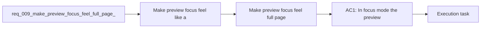

## item_016_make_preview_focus_feel_full_page_and_remove_panel_chrome - Make preview focus feel full page and remove panel chrome
> From version: 0.1.0
> Schema version: 1.0
> Status: Ready
> Understanding: 99%
> Confidence: 98%
> Progress: 0%
> Complexity: Medium
> Theme: UI
> Reminder: Update status/understanding/confidence/progress and linked task references when you edit this doc.

# Problem
- Make preview focus feel like a true full-page review mode rather than a panel that simply grows larger.
- Remove the remaining panel decoration that breaks the immersive effect in focus mode.
- Eliminate unnecessary spacing, rounded edges, and panel framing around the preview when focus mode is active.
- The current focus mode hides some surrounding UI, but it still reads visually as the same preview panel with leftover spacing and decoration.
- That breaks the intended product feeling: focus mode should feel like the preview has taken over the page, not like the user is still looking at a card inside the workspace.

# Scope
- In:
  - remove panel framing, rounded corners, and leftover decorative spacing in focus mode
  - make the preview surface feel like it takes over the page
  - keep focus-mode controls compact and understandable
  - validate desktop and mobile focus-mode behavior
- Out:
  - moving controls into the header itself
  - generated Mermaid validation or fallback handling

# Acceptance criteria
- AC1: In focus mode, the preview no longer appears as a decorated panel inside the workspace.
- AC2: Borders, rounded corners, and unnecessary outer spacing around the preview are removed or materially reduced in focus mode.
- AC3: The focused preview surface uses the available page area much more directly and gives the impression of taking over the page.
- AC4: The transition into focus mode remains coherent with the application shell and does not feel like a broken layout state.
- AC5: Controls required during focus mode remain understandable and accessible.
- AC6: The behavior is validated on desktop and mobile-sized layouts.

# AC Traceability
- AC1 -> Scope: In focus mode, the preview no longer appears as a decorated panel inside the workspace.. Proof: desktop browser validation and visual review.
- AC2 -> Scope: Borders, rounded corners, and unnecessary outer spacing around the preview are removed or materially reduced in focus mode.. Proof: focused-layout comparison and browser validation.
- AC3 -> Scope: The focused preview surface uses the available page area much more directly and gives the impression of taking over the page.. Proof: interactive focus-mode checks.
- AC4 -> Scope: The transition into focus mode remains coherent with the application shell and does not feel like a broken layout state.. Proof: transition and shell integration review.
- AC5 -> Scope: Controls required during focus mode remain understandable and accessible.. Proof: keyboard and responsive interaction checks.
- AC6 -> Scope: The behavior is validated on desktop and mobile-sized layouts.. Proof: desktop and mobile browser validation.

# Decision framing
- Product framing: Required
- Product signals: conversion journey, navigation and discoverability
- Product follow-up: Create or link a product brief before implementation moves deeper into delivery.
- Architecture framing: Consider
- Architecture signals: data model and persistence
- Architecture follow-up: Review whether an architecture decision is needed before implementation becomes harder to reverse.

# Links
- Product brief(s): `prod_000_mermaid_generator_product_direction`
- Architecture decision(s): `adr_000_choose_a_static_pwa_architecture_for_mermaid_generator`
- Request: `req_009_make_preview_focus_feel_full_page_instead_of_panel_based`
- Primary task(s): `task_003_orchestrate_mermaid_hardening_and_compact_header_focus_delivery`

# AI Context
- Summary: Refine preview focus mode so it feels like a true page takeover, with panel framing, rounded corners, and...
- Keywords: preview focus, full page, immersive mode, panel chrome, rounded corners, spacing, shell refinement, focus layout
- Use when: Use when the preview focus state should become visually immersive and stop reading as a leftover panel layout.
- Skip when: Skip when the work only concerns generation quality, providers, onboarding, or unrelated header navigation changes.

# References
- `logics/request/req_004_refine_workspace_chrome_help_export_footer_and_preview_focus_behavior.md`
- `logics/request/req_008_compact_header_and_move_preview_controls_into_icon_based_navigation.md`
- `logics/product/prod_000_mermaid_generator_product_direction.md`
- `logics/architecture/adr_000_choose_a_static_pwa_architecture_for_mermaid_generator.md`
- `src/App.tsx`
- `src/App.css`
- `logics/skills/logics-ui-steering/SKILL.md`

# Priority
- Impact: High
- Urgency: Medium

# Notes
- Derived from request `req_009_make_preview_focus_feel_full_page_instead_of_panel_based`.
- Source file: `logics/request/req_009_make_preview_focus_feel_full_page_instead_of_panel_based.md`.
- Request context seeded into this backlog item from `logics/request/req_009_make_preview_focus_feel_full_page_instead_of_panel_based.md`.
