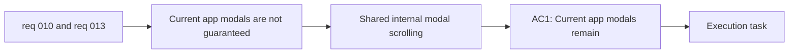

## item_017_standardize_modal_internal_scrolling_across_current_modal_surfaces - Standardize modal internal scrolling across current modal surfaces
> From version: 0.1.0+wave1
> Schema version: 1.0
> Status: Done
> Understanding: 99%
> Confidence: 97%
> Progress: 100%
> Complexity: Medium
> Theme: UI
> Reminder: Update status/understanding/confidence/progress and linked task references when you edit this doc.

# Problem
- Current app modals are not guaranteed to remain usable when their content exceeds the available viewport height.
- On mobile and short laptop heights, modal content can become clipped or partially unreachable, which blocks access to actions inside `Settings`, `Export`, or onboarding flows.
- The app needs one shared scrolling rule for current modal surfaces so modal usability does not depend on each modal inventing its own overflow behavior.

# Scope
- In:
  - define a shared internal scrolling approach for the current modal surfaces in the app
  - ensure modal content remains reachable when viewport height is constrained
  - apply the scrolling model to existing modals such as `Settings`, `Export`, and onboarding
  - validate the behavior on mobile-sized and short-height viewports
- Out:
  - modal backdrop layering and viewport coverage rules
  - keyboard dismissal behavior
  - share-link generation logic

# Acceptance criteria
- AC1: Current app modals remain usable when their content exceeds the available viewport height, including on mobile-sized screens.
- AC2: Modal content and actions remain reachable without clipping on shorter viewports.
- AC3: The standardized scrolling behavior relies on the modal surface or modal content region rather than on the page behind the modal staying scrollable.
- AC4: The shared scrolling behavior is applied across the current app modals instead of only one surface.

# AC Traceability
- AC1 -> Scope: define a shared internal scrolling approach for the current modal surfaces in the app. Proof: modal viewport validation.
- AC2 -> Scope: ensure modal content remains reachable when viewport height is constrained. Proof: mobile and short-height interaction checks.
- AC3 -> Scope: define a shared internal scrolling approach for the current modal surfaces in the app. Proof: behavior review of modal/container overflow rules.
- AC4 -> Scope: apply the scrolling model to existing modals such as `Settings`, `Export`, and onboarding. Proof: cross-modal browser validation.

# Decision framing
- Product framing: Required
- Product signals: experience scope, navigation and discoverability
- Product follow-up: Keep the modal interaction model aligned with the current product-native shell direction.
- Architecture framing: Consider
- Architecture signals: runtime and boundaries
- Architecture follow-up: Reuse the static browser-first shell without introducing route-based modal detours.

# Links
- Product brief(s): `prod_000_mermaid_generator_product_direction`
- Architecture decision(s): `adr_000_choose_a_static_pwa_architecture_for_mermaid_generator`
- Request: `req_010_make_settings_modal_scrollable_and_dismissible_with_escape`, `req_013_standardize_modal_scrolling_and_overlay_layering_across_viewports`
- Primary task(s): `task_004_orchestrate_modal_system_standardization_and_mermaid_share_link_delivery`

# AI Context
- Summary: Standardize internal scrolling for the app's current modal surfaces so tall modal content remains reachable on mobile and short viewports without relying on page scrolling behind the modal.
- Keywords: modal scroll, viewport height, mobile modal, overflow, settings modal, export modal, onboarding modal
- Use when: Use when implementing the shared modal scrolling behavior across current app modal surfaces.
- Skip when: Skip when the work only concerns layering, keyboard dismissal, or share-link generation.

# Priority
- Impact: High
- Urgency: High

# Notes
- Derived from requests `req_010_make_settings_modal_scrollable_and_dismissible_with_escape` and `req_013_standardize_modal_scrolling_and_overlay_layering_across_viewports`.
- This split isolates shared scroll usability from backdrop/layering rules so mobile reachability can be delivered and validated independently.
- Delivered in `task_004_orchestrate_modal_system_standardization_and_mermaid_share_link_delivery` wave 1 by bounding current modal surfaces to the viewport, moving overflow into shared internal scroll containers, and validating short mobile viewport reachability across onboarding, settings, and export.
