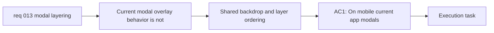

## item_018_standardize_modal_overlay_coverage_and_layer_ordering_across_viewports - Standardize modal overlay coverage and layer ordering across viewports

> From version: 0.1.0+wave2
> Schema version: 1.0
> Status: Done
> Understanding: 99%
> Confidence: 97%
> Progress: 100%
> Complexity: Medium
> Theme: UI
> Reminder: Update status/understanding/confidence/progress and linked task references when you edit this doc.

# Problem

- Current modal overlay behavior is not standardized across mobile and desktop viewports.
- On mobile, modals should clearly sit above the page, while on desktop the product may keep the sticky header visible but still needs the backdrop to cover the rest of the page cleanly.
- Without explicit layer ordering and backdrop rules, modal surfaces, backdrop coverage, page content, and preserved header chrome can conflict and look broken.

# Scope

- In:
  - define shared overlay and z-index rules for current modal surfaces and their backdrops
  - ensure mobile modals render above the page content with full page coverage behind them
  - preserve the desktop shell exception where the header may remain visible while the backdrop still covers the rest of the page
  - validate modal stacking and backdrop coverage across mobile and desktop layouts
- Out:
  - modal internal content scrolling rules
  - settings-specific keyboard dismissal logic
  - share-link generation and URL hydration behavior

# Acceptance criteria

- AC1: On mobile, current app modals render above the page content with backdrop coverage that visually owns the full page behind the modal.
- AC2: On desktop, the product may keep the sticky header visible while the modal backdrop still covers the full page area outside that preserved header region.
- AC3: No page content incorrectly appears above the modal surface because of broken z-index or incomplete overlay layering.
- AC4: The standardized overlay behavior applies across the app's current modal surfaces rather than only one modal.

# AC Traceability

- AC1 -> Scope: ensure mobile modals render above the page content with full page coverage behind them. Proof: mobile overlay browser validation.
- AC2 -> Scope: preserve the desktop shell exception where the header may remain visible while the backdrop still covers the rest of the page. Proof: desktop overlay checks with sticky header present.
- AC3 -> Scope: define shared overlay and z-index rules for current modal surfaces and their backdrops. Proof: layering review and responsive validation.
- AC4 -> Scope: validate modal stacking and backdrop coverage across mobile and desktop layouts. Proof: cross-modal browser validation.

# Decision framing

- Product framing: Required
- Product signals: experience scope, navigation and discoverability
- Product follow-up: Keep the preserved desktop header exception explicit in the product shell behavior.
- Architecture framing: Consider
- Architecture signals: runtime and boundaries
- Architecture follow-up: Implement this as a shared modal-layer rule set inside the existing static shell.

# Links

- Product brief(s): `prod_000_mermaid_generator_product_direction`
- Architecture decision(s): `adr_000_choose_a_static_pwa_architecture_for_mermaid_generator`
- Request: `req_013_standardize_modal_scrolling_and_overlay_layering_across_viewports`
- Primary task(s): `task_004_orchestrate_modal_system_standardization_and_mermaid_share_link_delivery`

# AI Context

- Summary: Standardize modal backdrop coverage and layer ordering so mobile modals fully dominate the page and desktop can keep the header visible while the backdrop still covers the rest of the page.
- Keywords: modal overlay, backdrop, z-index, mobile modal, desktop header, layer ordering, viewport coverage
- Use when: Use when implementing the shared modal overlay and backdrop rules across the app.
- Skip when: Skip when the work only concerns modal scrolling, keyboard dismissal, or share-link logic.

# Priority

- Impact: High
- Urgency: High

# Notes

- Derived from request `req_013_standardize_modal_scrolling_and_overlay_layering_across_viewports`.
- This split isolates backdrop and z-index behavior from modal content scrolling so the shell-layer model can be validated independently.
- Delivered in `task_004_orchestrate_modal_system_standardization_and_mermaid_share_link_delivery` wave 2 by making desktop backdrops start below the preserved sticky header, keeping mobile backdrops full-screen above the page, and validating the responsive layer ownership in browser flows.
