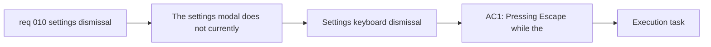

## item_019_add_keyboard_dismissal_semantics_to_the_settings_modal - Add keyboard dismissal semantics to the settings modal
> From version: 0.1.0
> Schema version: 1.0
> Status: Ready
> Understanding: 99%
> Confidence: 98%
> Progress: 0%
> Complexity: Medium
> Theme: UI
> Reminder: Update status/understanding/confidence/progress and linked task references when you edit this doc.

# Problem
- The `Settings` modal does not currently expose a keyboard dismissal path equivalent to clicking `Close`.
- Users who expect standard modal behavior cannot dismiss `Settings` with `Escape`, which makes the interaction feel incomplete and less accessible.
- The app needs one explicit close path for `Escape` that matches the current `Close` behavior rather than introducing a divergent teardown path.

# Scope
- In:
  - add `Escape` dismissal support for the `Settings` modal
  - ensure the keyboard dismissal path has the same user-facing effect as clicking `Close`
  - validate the behavior from normal modal focus states on desktop and mobile keyboard-capable flows
- Out:
  - modal scrollability changes
  - cross-modal overlay coverage rules
  - adding keyboard dismissal to every modal in the app unless needed for implementation reuse

# Acceptance criteria
- AC1: Pressing `Escape` while the `Settings` modal is open closes it.
- AC2: The `Escape` dismissal path produces the same user-facing outcome as activating the existing `Close` action.
- AC3: The keyboard dismissal behavior works from normal modal focus states and does not require pointer interaction.

# AC Traceability
- AC1 -> Scope: add `Escape` dismissal support for the `Settings` modal. Proof: keyboard interaction checks.
- AC2 -> Scope: ensure the keyboard dismissal path has the same user-facing effect as clicking `Close`. Proof: close-path behavior review and browser validation.
- AC3 -> Scope: validate the behavior from normal modal focus states on desktop and mobile keyboard-capable flows. Proof: interaction validation.

# Decision framing
- Product framing: Required
- Product signals: experience scope
- Product follow-up: Keep the dismissal semantics aligned with the existing modal UX direction already described in the product brief.
- Architecture framing: Not needed
- Architecture signals: (none detected)
- Architecture follow-up: No architecture decision follow-up is expected based on current signals.

# Links
- Product brief(s): `prod_000_mermaid_generator_product_direction`
- Architecture decision(s): `adr_000_choose_a_static_pwa_architecture_for_mermaid_generator`
- Request: `req_010_make_settings_modal_scrollable_and_dismissible_with_escape`
- Primary task(s): `task_004_orchestrate_modal_system_standardization_and_mermaid_share_link_delivery`

# AI Context
- Summary: Add standard keyboard dismissal semantics to the Settings modal so pressing Escape closes it exactly like the current Close action.
- Keywords: settings modal, escape key, keyboard dismissal, close semantics, modal accessibility
- Use when: Use when implementing or reviewing the Settings modal keyboard dismissal behavior.
- Skip when: Skip when the work concerns scrolling, layering, or unrelated share-link behavior.

# Priority
- Impact: Medium
- Urgency: High

# Notes
- Derived from request `req_010_make_settings_modal_scrollable_and_dismissible_with_escape`.
- This split isolates the keyboard close behavior so it can ship independently of the broader cross-modal scrolling and overlay standardization.
