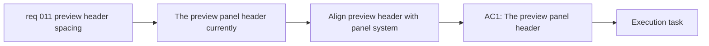

## item_020_align_preview_panel_header_spacing_with_the_workspace_panel_system - Align preview panel header spacing with the workspace panel system

> From version: 0.1.0+wave4
> Schema version: 1.0
> Status: Done
> Understanding: 99%
> Confidence: 98%
> Progress: 100%
> Complexity: Medium
> Theme: UI
> Reminder: Update status/understanding/confidence/progress and linked task references when you edit this doc.

# Problem

- The `Preview` panel header currently reads larger and looser than the headers of `Mermaid source` and `Prompt draft`.
- This inconsistency creates excess empty space above the preview surface and makes the right panel feel visually detached from the rest of the workspace shell.
- The mismatch appears to come from the preview header not sharing the same structural header treatment and heading reset behavior as the other panels.

# Scope

- In:
  - align the preview panel header spacing and title treatment with the rest of the panel system
  - preserve the preview help affordance while fixing the spacing mismatch
  - validate the normal workspace state and ensure focus mode still hides preview-local chrome as intended
- Out:
  - redesigning preview focus mode
  - changing preview interaction behavior or rendering logic
  - unrelated shell compactness work

# Acceptance criteria

- AC1: The `Preview` panel header uses spacing and title treatment that visually align with `Mermaid source` and `Prompt draft`.
- AC2: The `Preview` heading no longer keeps browser-default spacing that creates excess empty space above the preview surface.
- AC3: The preview help affordance remains present and usable after the spacing alignment.
- AC4: Focus mode behavior does not regress and still hides preview-local header chrome as intended.

# AC Traceability

- AC1 -> Scope: align the preview panel header spacing and title treatment with the rest of the panel system. Proof: UI comparison and browser validation.
- AC2 -> Scope: align the preview panel header spacing and title treatment with the rest of the panel system. Proof: heading reset review and workspace validation.
- AC3 -> Scope: preserve the preview help affordance while fixing the spacing mismatch. Proof: interaction checks for preview help.
- AC4 -> Scope: validate the normal workspace state and ensure focus mode still hides preview-local chrome as intended. Proof: focus-mode validation.

# Decision framing

- Product framing: Not needed
- Product signals: (none detected)
- Product follow-up: No product brief follow-up is expected based on current signals.
- Architecture framing: Not needed
- Architecture signals: (none detected)
- Architecture follow-up: No architecture decision follow-up is expected based on current signals.

# Links

- Product brief(s): `prod_000_mermaid_generator_product_direction`
- Architecture decision(s): `adr_000_choose_a_static_pwa_architecture_for_mermaid_generator`
- Request: `req_011_align_preview_panel_header_spacing_with_other_panels`
- Primary task(s): `task_004_orchestrate_modal_system_standardization_and_mermaid_share_link_delivery`

# AI Context

- Summary: Align the Preview panel header with the workspace panel system so its title scale and spacing match the other panels instead of keeping a looser browser-default treatment.
- Keywords: preview panel, header spacing, title reset, panel system, shell consistency
- Use when: Use when implementing or reviewing the preview panel header consistency fix.
- Skip when: Skip when the change concerns modal behavior, share links, or preview rendering logic.

# Priority

- Impact: Medium
- Urgency: Medium

# Notes

- Derived from request `req_011_align_preview_panel_header_spacing_with_other_panels`.
- This item isolates a small but visible shell consistency defect so it can be delivered without coupling it to the modal or share-link work.
- Delivered in `task_004_orchestrate_modal_system_standardization_and_mermaid_share_link_delivery` wave 4 by moving the preview header back onto the shared panel-header structure so title reset and spacing behavior match the rest of the workspace panel system.
