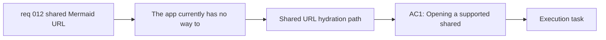

## item_021_add_url_hydration_support_for_shared_mermaid_diagrams - Add URL hydration support for shared Mermaid diagrams
> From version: 0.1.0+wave5
> Schema version: 1.0
> Status: Done
> Understanding: 98%
> Confidence: 96%
> Progress: 100%
> Complexity: Medium
> Theme: UI
> Reminder: Update status/understanding/confidence/progress and linked task references when you edit this doc.

# Problem
- The app currently has no way to restore Mermaid source state from a shared URL.
- Before the export UI can generate share links, the runtime needs a deterministic URL-state contract that can hydrate the editor and preview directly from the opened link.
- The hydration path must restore Mermaid as a normal editable source of truth rather than as a one-off imported artifact.

# Scope
- In:
  - define and implement the URL payload read path for shared Mermaid source
  - hydrate the editor source from a shared URL when the app opens with that payload
  - ensure the preview renders automatically from the hydrated Mermaid source
  - keep the hydrated Mermaid fully editable after load
- Out:
  - adding the export modal action that creates and copies the share link
  - toast UX after clipboard copy
  - server-side document persistence or account-based sharing

# Acceptance criteria
- AC1: Opening a supported shared Mermaid URL hydrates the editor with the Mermaid source contained in the link.
- AC2: After hydration from the URL, the preview is already in sync with the loaded Mermaid source without requiring extra user action.
- AC3: After loading from the shared URL, the Mermaid source remains editable like any normal source in the app.
- AC4: When no shared Mermaid payload is present, the app keeps its normal startup behavior.

# AC Traceability
- AC1 -> Scope: hydrate the editor source from a shared URL when the app opens with that payload. Proof: shared-link browser validation.
- AC2 -> Scope: ensure the preview renders automatically from the hydrated Mermaid source. Proof: runtime hydration checks and browser validation.
- AC3 -> Scope: keep the hydrated Mermaid fully editable after load. Proof: post-hydration editor interaction checks.
- AC4 -> Scope: define and implement the URL payload read path for shared Mermaid source. Proof: startup behavior regression checks.

# Decision framing
- Product framing: Required
- Product signals: conversion journey, experience scope
- Product follow-up: Keep the shared-link hydration behavior aligned with the product promise that Mermaid remains the editable source of truth.
- Architecture framing: Required
- Architecture signals: contracts and integration, runtime and boundaries, data model and persistence
- Architecture follow-up: Keep the URL-state design compatible with the static browser-first architecture and avoid introducing server persistence.

# Links
- Product brief(s): `prod_000_mermaid_generator_product_direction`
- Architecture decision(s): `adr_000_choose_a_static_pwa_architecture_for_mermaid_generator`
- Request: `req_012_share_mermaid_diagrams_through_generated_urls_from_export`
- Primary task(s): `task_004_orchestrate_modal_system_standardization_and_mermaid_share_link_delivery`

# AI Context
- Summary: Add the runtime URL hydration path for shared Mermaid diagrams so opening a supported link restores the Mermaid source, renders the preview, and leaves the source editable.
- Keywords: share URL, Mermaid hydration, URL state, editor source, preview sync, startup state
- Use when: Use when implementing or reviewing the share-link read path and startup hydration behavior.
- Skip when: Skip when the work only concerns export-modal UX or clipboard toast behavior.

# Priority
- Impact: High
- Urgency: Medium

# Notes
- Derived from request `req_012_share_mermaid_diagrams_through_generated_urls_from_export`.
- This split establishes the shared URL runtime contract before the export modal grows a share-link creation action.
- Delivered in `task_004_orchestrate_modal_system_standardization_and_mermaid_share_link_delivery` wave 5 by adding a shared Mermaid URL encoding and hydration helper, loading shared Mermaid into the editor at startup, syncing preview rendering from that hydrated source, and suppressing onboarding when a shared Mermaid link is opened directly.
