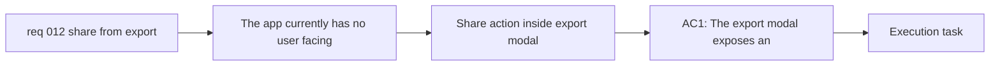

## item_022_add_export_modal_share_link_action_with_clipboard_toast - Add export modal share link action with clipboard toast
> From version: 0.1.0
> Schema version: 1.0
> Status: Ready
> Understanding: 98%
> Confidence: 96%
> Progress: 0%
> Complexity: Medium
> Theme: UI
> Reminder: Update status/understanding/confidence/progress and linked task references when you edit this doc.

# Problem
- The app currently has no user-facing way to create and copy a shareable Mermaid URL from the existing export surface.
- Even after URL hydration support exists, users still need a coherent entry point inside `Export` to generate the link and immediate feedback that the copy succeeded.
- The share flow should extend the existing export surface instead of adding another top-level button or navigation branch.

# Scope
- In:
  - add a share-link action inside the `Export` modal
  - generate a shareable URL for the current Mermaid source using the shared URL contract
  - copy the generated URL to the clipboard
  - show a lightweight toast confirming successful copy
- Out:
  - implementing the URL hydration read path itself
  - server-side sharing, collaboration, or document history
  - replacing SVG or PNG export behavior

# Acceptance criteria
- AC1: The `Export` modal exposes an action that generates a shareable URL for the current Mermaid diagram.
- AC2: Triggering that action copies the generated URL to the clipboard.
- AC3: After the URL is copied, the app shows a short-lived toast confirming that the share link has been copied.
- AC4: The share-link action fits coherently inside the existing `Export` modal rather than requiring a separate top-level sharing entry point.

# AC Traceability
- AC1 -> Scope: add a share-link action inside the `Export` modal. Proof: export modal browser validation.
- AC2 -> Scope: copy the generated URL to the clipboard. Proof: clipboard interaction validation.
- AC3 -> Scope: show a lightweight toast confirming successful copy. Proof: share-flow UI validation.
- AC4 -> Scope: add a share-link action inside the `Export` modal. Proof: export surface review and browser validation.

# Decision framing
- Product framing: Required
- Product signals: conversion journey, navigation and discoverability
- Product follow-up: Keep sharing inside the current export flow instead of branching the shell into a second top-level action.
- Architecture framing: Consider
- Architecture signals: contracts and integration
- Architecture follow-up: Reuse the URL-state contract established by the shared Mermaid hydration item.

# Links
- Product brief(s): `prod_000_mermaid_generator_product_direction`
- Architecture decision(s): `adr_000_choose_a_static_pwa_architecture_for_mermaid_generator`
- Request: `req_012_share_mermaid_diagrams_through_generated_urls_from_export`
- Primary task(s): `task_004_orchestrate_modal_system_standardization_and_mermaid_share_link_delivery`

# AI Context
- Summary: Add the share-link action inside the Export modal so users can generate a Mermaid URL, copy it to the clipboard, and get a toast confirmation.
- Keywords: export modal, share link, clipboard, toast, share action, Mermaid URL
- Use when: Use when implementing or reviewing the share-link creation UI inside the Export modal.
- Skip when: Skip when the work only concerns URL hydration or unrelated modal shell behavior.

# Priority
- Impact: High
- Urgency: Medium

# Notes
- Derived from request `req_012_share_mermaid_diagrams_through_generated_urls_from_export`.
- This split keeps the export-surface UX and toast feedback separate from the lower-level URL hydration contract.
