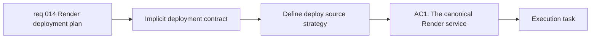

## item_023_define_render_deployment_contract_and_release_source_strategy - Define Render deployment contract and release source strategy
> From version: 0.1.0
> Schema version: 1.0
> Status: Done
> Understanding: 98%
> Confidence: 97%
> Progress: 100%
> Complexity: Medium
> Theme: Deployment
> Reminder: Update status/understanding/confidence/progress and linked task references when you edit this doc.

# Problem
- The repository already contains a Render static blueprint, but the deployment contract is still implicit rather than operator-safe.
- The relationship between `main`, `release`, and version tags is not yet formalized as the canonical Render deployment source strategy.
- Operators should not need to reconstruct deployment intent from git history, release actions, and Render UI guesses.

# Scope
- In:
  - define the canonical Render service model for Mermaid Generator
  - define which branch or tag should be used for deployment and how `main`, `release`, and tags participate
  - document the expected Render form fields and blueprint contract as the authoritative deploy source
- Out:
  - changing the app architecture away from static hosting
  - implementing frontend performance optimizations
  - adding runtime application features

# Acceptance criteria
- AC1: The canonical Render service type and static hosting contract are documented as the intended deployment model.
- AC2: The deployment source strategy clearly defines how `main`, `release`, and version tags are used.
- AC3: Operators can determine the correct Render setup values and release source without guessing from unrelated docs.

# AC Traceability
- AC1 -> Scope: define the canonical Render service model. Proof: deployment documentation update.
- AC2 -> Scope: define which branch or tag should be used for deployment. Proof: documented release-source workflow.
- AC3 -> Scope: document the expected Render form fields and blueprint contract. Proof: operator-facing deploy plan review.

# Decision framing
- Product framing: Consider
- Product signals: navigation and discoverability
- Product follow-up: Keep deployment guidance consistent with the shipped release workflow users indirectly depend on.
- Architecture framing: Required
- Architecture signals: runtime and boundaries, deployment and environments
- Architecture follow-up: Keep the deploy contract aligned with the static PWA ADR and existing `render.yaml`.

# Links
- Product brief(s): `prod_000_mermaid_generator_product_direction`
- Architecture decision(s): `adr_000_choose_a_static_pwa_architecture_for_mermaid_generator`
- Request: `req_014_define_a_render_deployment_plan_for_mermaid_generator`
- Primary task(s): `task_005_orchestrate_render_hardening_provider_expansion_and_in_app_changelog_delivery`

# AI Context
- Summary: Define the explicit Render deployment contract and release source strategy so operators know exactly what gets deployed and from where.
- Keywords: Render, deployment, release branch, tag, main, static site, blueprint
- Use when: Use when documenting the canonical deployment source model for Mermaid Generator on Render.
- Skip when: Skip when the work concerns frontend performance or runtime feature work.

# Priority
- Impact: High
- Urgency: Medium

# Notes
- Derived from request `req_014_define_a_render_deployment_plan_for_mermaid_generator`.
- This split isolates the branch, tag, and Render contract question from the validation and rollback runbook.
- Delivered through `README.md`, `render.yaml`, and `adr_001_define_static_deployment_and_release_branch_workflow.md`, which now define Render Static Site as the canonical deploy target and `release` as the operator-facing deployment branch with version tags identifying the shipped revision.
