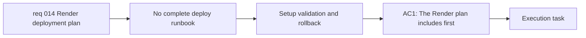

## item_024_document_render_setup_validation_and_rollback_runbook - Document Render setup, validation, and rollback runbook
> From version: 0.1.0
> Schema version: 1.0
> Status: Done
> Understanding: 98%
> Confidence: 97%
> Progress: 100%
> Complexity: Medium
> Theme: Deployment
> Reminder: Update status/understanding/confidence/progress and linked task references when you edit this doc.

# Problem
- Even with the Render service contract defined, operators still need a repeatable runbook for first setup, release checks, and rollback.
- Release deployment should include concrete validation before and after publish rather than implicit manual intuition.
- Broken releases need a documented rollback or redeploy path that fits the current static Render model.

# Scope
- In:
  - document first-time Render setup steps
  - document pre-deploy and post-deploy validation checks for the static app
  - document rollback or redeploy actions for a broken release
- Out:
  - changing provider, modal, or changelog UX
  - implementing new deployment automation beyond what the current repo already supports
  - bundle optimization work

# Acceptance criteria
- AC1: The Render plan includes first-time setup guidance appropriate for the current static app.
- AC2: The deployment plan includes practical pre-deploy and post-deploy validation steps.
- AC3: The deployment plan includes a rollback or redeploy path for a broken published release.

# AC Traceability
- AC1 -> Scope: document first-time Render setup steps. Proof: deployment runbook review.
- AC2 -> Scope: document pre-deploy and post-deploy validation checks. Proof: validation checklist review.
- AC3 -> Scope: document rollback or redeploy actions. Proof: rollback section review.

# Decision framing
- Product framing: Consider
- Product signals: experience scope
- Product follow-up: Keep validation focused on the user-visible workspace and release version confidence.
- Architecture framing: Required
- Architecture signals: deployment and environments, operability
- Architecture follow-up: Keep rollback paths consistent with the static site release model on Render.

# Links
- Product brief(s): `prod_000_mermaid_generator_product_direction`
- Architecture decision(s): `adr_000_choose_a_static_pwa_architecture_for_mermaid_generator`
- Request: `req_014_define_a_render_deployment_plan_for_mermaid_generator`
- Primary task(s): `task_005_orchestrate_render_hardening_provider_expansion_and_in_app_changelog_delivery`

# AI Context
- Summary: Document the practical Render operator runbook covering setup, validation, and rollback for Mermaid Generator releases.
- Keywords: Render, runbook, validation, rollback, redeploy, setup, release
- Use when: Use when writing the operator-facing deploy checklist and rollback guidance.
- Skip when: Skip when the work only defines branch/tag strategy or only adjusts runtime code.

# Priority
- Impact: High
- Urgency: Medium

# Notes
- Derived from request `req_014_define_a_render_deployment_plan_for_mermaid_generator`.
- This split isolates operational execution and rollback guidance from the higher-level deployment source contract.
- Delivered through the Render runbook updates in `README.md` and `adr_001_define_static_deployment_and_release_branch_workflow.md`, including first setup, pre/post-deploy checks, and rollback guidance for broken static releases.
