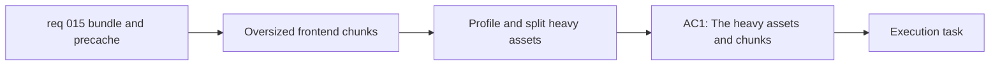

## item_025_profile_and_split_heavy_frontend_chunks_without_regressing_core_flows - Profile and split heavy frontend chunks without regressing core flows
> From version: 0.1.0
> Schema version: 1.0
> Status: Done
> Understanding: 98%
> Confidence: 96%
> Progress: 100%
> Complexity: Medium
> Theme: Performance
> Reminder: Update status/understanding/confidence/progress and linked task references when you edit this doc.

# Problem
- The current Render production build emits oversized frontend chunks, especially around Mermaid-heavy assets.
- The app ships more JavaScript than needed for the initial load, which is a poor default for mobile and slower networks.
- The warning should lead to real first-load improvements rather than being silenced cosmetically.

# Scope
- In:
  - identify the heavy dependencies and chunks driving the current warning output
  - improve chunking or loading strategy to reduce first-load cost
  - preserve validated core user flows while changing the load strategy
- Out:
  - changing the app’s static hosting model
  - PWA cache-policy tuning by itself
  - unrelated UI redesigns

# Acceptance criteria
- AC1: The heavy assets and chunks driving the current build warnings are identified and documented.
- AC2: The implemented change reduces initial app-load cost rather than only suppressing warning output.
- AC3: Core flows such as preview, export, share, onboarding, settings, and responsive navigation remain validated after the optimization.

# AC Traceability
- AC1 -> Scope: identify the heavy dependencies and chunks. Proof: build profiling evidence.
- AC2 -> Scope: improve chunking or loading strategy. Proof: build output comparison.
- AC3 -> Scope: preserve validated core user flows. Proof: test and browser validation.

# Decision framing
- Product framing: Consider
- Product signals: conversion journey, experience scope
- Product follow-up: Keep performance work user-visible through faster initial load without changing the product loop.
- Architecture framing: Required
- Architecture signals: runtime and boundaries, performance and capacity
- Architecture follow-up: Prefer maintainable splitting and lazy-loading strategies that survive Mermaid upgrades.

# Links
- Product brief(s): `prod_000_mermaid_generator_product_direction`
- Architecture decision(s): `adr_000_choose_a_static_pwa_architecture_for_mermaid_generator`
- Request: `req_015_reduce_render_bundle_weight_and_pwa_precache_cost`, `req_016_harden_runtime_security_delivery_performance_and_repo_maintainability`
- Primary task(s): `task_005_orchestrate_render_hardening_provider_expansion_and_in_app_changelog_delivery`

# AI Context
- Summary: Profile the heavy frontend chunks and improve the loading strategy so Mermaid Generator ships a lighter first load without breaking core flows.
- Keywords: Vite, bundle size, chunking, lazy loading, Mermaid, performance
- Use when: Use when reducing oversized chunk warnings through real first-load improvements.
- Skip when: Skip when the work only changes cache headers or deployment docs.

# Priority
- Impact: High
- Urgency: Medium

# Notes
- Derived from requests `req_015_reduce_render_bundle_weight_and_pwa_precache_cost` and `req_016_harden_runtime_security_delivery_performance_and_repo_maintainability`.
- This split isolates chunk profiling and load-strategy optimization from cache-policy and PWA delivery work.
- Delivered through lazy-loaded secondary modals, React vendor chunk splitting, and build profiling updates. The initial shell and precache cost dropped materially, while the remaining `mermaid.core` and `wardley` warnings are now an explicit documented tradeoff rather than silent debt.
