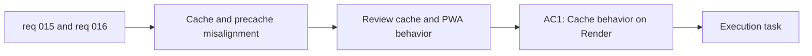

## item_026_align_render_cache_and_pwa_precache_behavior_with_static_asset_delivery - Align Render cache and PWA precache behavior with static asset delivery

> From version: 0.1.0
> Schema version: 1.0
> Status: Done
> Understanding: 98%
> Confidence: 96%
> Progress: 100%
> Complexity: Medium
> Theme: Performance
> Reminder: Update status/understanding/confidence/progress and linked task references when you edit this doc.

# Problem

- Current Render delivery disables caching for all paths, which conflicts with hashed static assets and the actual needs of a static frontend app.
- The PWA precache footprint is currently large enough that caching strategy should be intentional, not accidental.
- Delivery behavior and offline strategy should reinforce each other rather than pulling in opposite directions.

# Scope

- In:
  - review and adjust static cache behavior on Render
  - review and adjust the PWA precache strategy so the cache footprint is intentional
  - keep the result aligned with the current static hosting model
- Out:
  - redesigning the entire frontend bundle structure
  - changing runtime provider or modal features
  - introducing a backend cache layer

# Acceptance criteria

- AC1: Cache behavior on Render is reviewed and adjusted to match hashed static asset delivery.
- AC2: The PWA precache footprint is reviewed and tuned so cached assets are intentional for the product experience.
- AC3: The resulting delivery strategy remains coherent with the current static app architecture.

# AC Traceability

- AC1 -> Scope: review and adjust static cache behavior on Render. Proof: deploy-config review.
- AC2 -> Scope: review and adjust the PWA precache strategy. Proof: build and cache-footprint review.
- AC3 -> Scope: keep the result aligned with the current static hosting model. Proof: architecture consistency review.

# Decision framing

- Product framing: Consider
- Product signals: experience scope
- Product follow-up: Keep install/update cost and perceived freshness balanced against static hosting efficiency.
- Architecture framing: Required
- Architecture signals: deployment and environments, performance and capacity, runtime and boundaries
- Architecture follow-up: Align Render headers and PWA caching with the static PWA ADR.

# Links

- Product brief(s): `prod_000_mermaid_generator_product_direction`
- Architecture decision(s): `adr_000_choose_a_static_pwa_architecture_for_mermaid_generator`
- Request: `req_015_reduce_render_bundle_weight_and_pwa_precache_cost`, `req_016_harden_runtime_security_delivery_performance_and_repo_maintainability`
- Primary task(s): `task_005_orchestrate_render_hardening_provider_expansion_and_in_app_changelog_delivery`

# AI Context

- Summary: Review Render cache headers and PWA precache behavior so static delivery is coherent with hashed assets and intentional offline caching.
- Keywords: Render, cache headers, PWA, precache, static assets, service worker
- Use when: Use when aligning static delivery caching and offline behavior.
- Skip when: Skip when the work only concerns chunk splitting or docs.

# Priority

- Impact: High
- Urgency: Medium

# Notes

- Derived from requests `req_015_reduce_render_bundle_weight_and_pwa_precache_cost` and `req_016_harden_runtime_security_delivery_performance_and_repo_maintainability`.
- This split isolates delivery-policy work from chunk-splitting and structural refactor work.
- Delivered through explicit Render cache headers for hashed assets plus a tighter Workbox precache policy that excludes the heaviest Mermaid-adjacent chunks while preserving PWA correctness.
