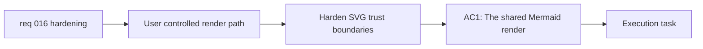

## item_027_harden_shared_mermaid_rendering_and_dom_injection_boundaries - Harden shared Mermaid rendering and DOM injection boundaries

> From version: 0.1.0
> Schema version: 1.0
> Status: Done
> Understanding: 99%
> Confidence: 97%
> Progress: 100%
> Complexity: High
> Theme: Security
> Reminder: Update status/understanding/confidence/progress and linked task references when you edit this doc.

# Problem

- Shared Mermaid source is user-controlled input that eventually becomes injected SVG in the preview surface.
- The current rendering path relies on a permissive Mermaid trust configuration and direct HTML injection.
- This should be hardened so the app has an explicit and safer trust model for shared diagrams.

# Scope

- In:
  - review the Mermaid render path and security posture for user-controlled source
  - harden the trust model around rendered SVG injection
  - preserve valid diagram preview behavior while reducing avoidable risk
- Out:
  - broad frontend modularization work
  - deployment documentation and cache-policy work
  - unrelated provider or changelog features

# Acceptance criteria

- AC1: The shared Mermaid render path is reviewed and updated so permissive trust assumptions are no longer left implicit.
- AC2: The preview injection boundary is hardened without breaking the expected valid Mermaid preview flow.
- AC3: The resulting trust model and tradeoffs are explicit in the implementation or linked docs.

# AC Traceability

- AC1 -> Scope: review the Mermaid render path and security posture. Proof: security-path review.
- AC2 -> Scope: harden the trust model around rendered SVG injection. Proof: implementation and regression validation.
- AC3 -> Scope: make the trust model explicit. Proof: code comment or doc linkage review.

# Decision framing

- Product framing: Consider
- Product signals: experience scope
- Product follow-up: Keep shareable Mermaid links safe enough for normal product use without surprising valid users.
- Architecture framing: Required
- Architecture signals: runtime and boundaries, contracts and integration, security and trust
- Architecture follow-up: Clarify the chosen trust model for Mermaid rendering within the static browser-first architecture.

# Links

- Product brief(s): `prod_000_mermaid_generator_product_direction`
- Architecture decision(s): `adr_000_choose_a_static_pwa_architecture_for_mermaid_generator`
- Request: `req_016_harden_runtime_security_delivery_performance_and_repo_maintainability`
- Primary task(s): `task_005_orchestrate_render_hardening_provider_expansion_and_in_app_changelog_delivery`

# AI Context

- Summary: Harden the Mermaid render pipeline and preview injection boundary for shared or user-controlled diagram source.
- Keywords: Mermaid, security, SVG injection, shared URL, trust model, preview
- Use when: Use when reducing the security risk of the current render-and-inject preview path.
- Skip when: Skip when the work only concerns bundle size, deploy docs, or UI polish.

# Priority

- Impact: High
- Urgency: High

# Notes

- Derived from request `req_016_harden_runtime_security_delivery_performance_and_repo_maintainability`.
- This split isolates the highest-risk security concern so it can land before broader refactors.
- Delivered through a stricter Mermaid trust posture in `src/lib/mermaid.ts`, including `securityLevel: "strict"` and SVG sanitization before preview injection so shared or user-controlled diagrams no longer rely on permissive raw trust.
