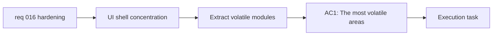

## item_028_reduce_app_shell_concentration_by_extracting_high_volatility_workspace_modules - Reduce App shell concentration by extracting high-volatility workspace modules
> From version: 0.1.0
> Schema version: 1.0
> Status: Done
> Understanding: 98%
> Confidence: 96%
> Progress: 100%
> Complexity: High
> Theme: Maintainability
> Reminder: Update status/understanding/confidence/progress and linked task references when you edit this doc.

# Problem
- `src/App.tsx` and `src/App.css` currently concentrate too much product logic and UI state in one place.
- Small workspace or modal changes have become riskier because many unrelated concerns live in the same files.
- The codebase needs a controlled structural split focused on the most volatile areas rather than continued monolith growth.

# Scope
- In:
  - identify the highest-volatility modules inside the current app shell
  - extract those modules into clearer boundaries with maintainable ownership
  - preserve current behavior and test coverage while reducing concentration
- Out:
  - redesigning the visual language
  - changing deployment behavior
  - broad dead-code cleanup that can land independently

# Acceptance criteria
- AC1: The most volatile areas of the current app shell are identified and extracted into clearer module boundaries.
- AC2: The structural split reduces concentration in `src/App.tsx` and `src/App.css` without changing validated user behavior.
- AC3: The resulting structure is easier to evolve for future workspace, settings, export, and mobile-shell changes.

# AC Traceability
- AC1 -> Scope: identify the highest-volatility modules. Proof: refactor plan and file review.
- AC2 -> Scope: extract those modules into clearer boundaries. Proof: structural diff plus regression validation.
- AC3 -> Scope: preserve current behavior while reducing concentration. Proof: test and browser validation.

# Decision framing
- Product framing: Consider
- Product signals: experience scope
- Product follow-up: Preserve the current workflow while making future UX work cheaper to deliver safely.
- Architecture framing: Required
- Architecture signals: runtime and boundaries, code organization and ownership
- Architecture follow-up: Keep the module split aligned with the current static React app shape.

# Links
- Product brief(s): `prod_000_mermaid_generator_product_direction`
- Architecture decision(s): `adr_000_choose_a_static_pwa_architecture_for_mermaid_generator`
- Request: `req_016_harden_runtime_security_delivery_performance_and_repo_maintainability`
- Primary task(s): `task_005_orchestrate_render_hardening_provider_expansion_and_in_app_changelog_delivery`

# AI Context
- Summary: Extract the highest-volatility areas from the oversized App shell so future UI and behavior changes carry less regression risk.
- Keywords: refactor, App.tsx, App.css, modularization, maintainability, workspace shell
- Use when: Use when reducing code concentration in the current app shell.
- Skip when: Skip when the work only concerns deployment, performance tuning, or documentation cleanup.

# Priority
- Impact: Medium
- Urgency: Medium

# Notes
- Derived from request `req_016_harden_runtime_security_delivery_performance_and_repo_maintainability`.
- This split focuses on structural concentration rather than dead-code hygiene or deploy/perf work.
- Delivered by extracting header, preview, settings, export, onboarding, and changelog modal concerns into dedicated components and helper modules, materially reducing the concentration in `src/App.tsx` and `src/App.css`.
