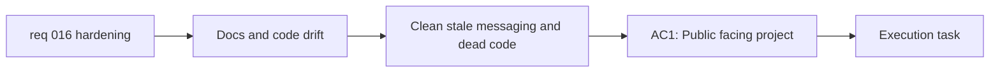

## item_029_clean_dead_code_and_realign_public_project_messaging_with_the_shipped_state - Clean dead code and realign public project messaging with the shipped state

> From version: 0.1.0
> Schema version: 1.0
> Status: Done
> Understanding: 98%
> Confidence: 97%
> Progress: 100%
> Complexity: Medium
> Theme: Hygiene
> Reminder: Update status/understanding/confidence/progress and linked task references when you edit this doc.

# Problem

- Some repository messaging is stale relative to the actual shipped product state.
- Some code surfaces appear non-authoritative or no longer actively used, which can mislead future changes.
- Post-release hygiene should reduce ambiguity in both docs and implementation.

# Scope

- In:
  - update public-facing docs that no longer reflect the released product state
  - remove or clearly deprecate dead or duplicate implementation surfaces
  - align repository messaging with the current shipped behavior and release posture
- Out:
  - broader structural refactor work
  - provider expansion work
  - deployment or bundle optimization changes

# Acceptance criteria

- AC1: Public-facing project messaging is updated to reflect the actual post-release state of Mermaid Generator.
- AC2: Dead, duplicate, or non-authoritative implementation surfaces are removed or clearly deprecated.
- AC3: The repository is easier to trust because docs and implementation point to the same current behavior.

# AC Traceability

- AC1 -> Scope: update public-facing docs. Proof: doc review.
- AC2 -> Scope: remove or clearly deprecate dead or duplicate implementation surfaces. Proof: code cleanup review.
- AC3 -> Scope: align repository messaging with current shipped behavior. Proof: final repo hygiene review.

# Decision framing

- Product framing: Consider
- Product signals: navigation and discoverability, experience scope
- Product follow-up: Keep repo-facing messaging honest so external readers and operators understand the shipped product quickly.
- Architecture framing: Consider
- Architecture signals: code organization and ownership
- Architecture follow-up: Remove misleading duplicate paths that obscure the true runtime surface.

# Links

- Product brief(s): `prod_000_mermaid_generator_product_direction`
- Architecture decision(s): `adr_000_choose_a_static_pwa_architecture_for_mermaid_generator`
- Request: `req_016_harden_runtime_security_delivery_performance_and_repo_maintainability`
- Primary task(s): `task_005_orchestrate_render_hardening_provider_expansion_and_in_app_changelog_delivery`

# AI Context

- Summary: Clean stale docs and dead implementation surfaces so the repo reflects the real shipped state of Mermaid Generator.
- Keywords: cleanup, dead code, README, release messaging, hygiene, deprecation
- Use when: Use when aligning public docs and code surfaces with the current release state.
- Skip when: Skip when the work is primarily a structural refactor or runtime feature addition.

# Priority

- Impact: Medium
- Urgency: Medium

# Notes

- Derived from request `req_016_harden_runtime_security_delivery_performance_and_repo_maintainability`.
- This split keeps repo hygiene separate from the structural refactor and the security/performance items.
- Delivered through README realignment to the shipped release state plus removal of stale implementation surfaces such as `src/lib/openai.ts` and `src/lib/useLocalStorageState.ts`.
