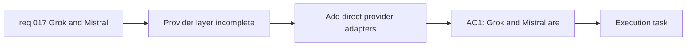

## item_030_add_direct_grok_and_mistral_provider_support_to_the_llm_adapter_layer - Add direct Grok and Mistral provider support to the LLM adapter layer

> From version: 0.1.0
> Schema version: 1.0
> Status: Done
> Understanding: 98%
> Confidence: 97%
> Progress: 100%
> Complexity: Medium
> Theme: Integration
> Reminder: Update status/understanding/confidence/progress and linked task references when you edit this doc.

# Problem

- The current provider layer stops at OpenAI, OpenRouter, and Anthropic.
- Product direction now requires `Grok` and `Mistral` as real selectable providers rather than aliases hidden behind another gateway.
- The provider layer should absorb this expansion without leaking provider-specific behavior into the rest of the app.

# Scope

- In:
  - add direct `Grok` provider support in the adapter layer
  - add direct `Mistral` provider support in the adapter layer
  - preserve the normalized provider contract used by the prompt-generation workflow
- Out:
  - redesigning the settings UX by itself
  - introducing advanced model-selection controls
  - moving away from the browser-first BYOK model

# Acceptance criteria

- AC1: `Grok` and `Mistral` are available as direct providers in the app’s provider abstraction.
- AC2: The prompt-generation flow can use those providers through the same normalized contract as the existing providers.
- AC3: Provider-specific API differences remain contained inside the adapter layer.

# AC Traceability

- AC1 -> Scope: add direct `Grok` and `Mistral` provider support. Proof: provider configuration review.
- AC2 -> Scope: preserve the normalized provider contract. Proof: generation-path validation.
- AC3 -> Scope: keep provider-specific API differences inside the adapter layer. Proof: code-structure review.

# Decision framing

- Product framing: Required
- Product signals: experience scope, conversion journey
- Product follow-up: Keep provider expansion real and explicit instead of hiding it behind an unrelated gateway.
- Architecture framing: Required
- Architecture signals: contracts and integration, runtime and boundaries
- Architecture follow-up: Keep the provider contract normalized as the provider matrix grows.

# Links

- Product brief(s): `prod_000_mermaid_generator_product_direction`
- Architecture decision(s): `adr_000_choose_a_static_pwa_architecture_for_mermaid_generator`
- Request: `req_017_add_grok_and_mistral_providers_and_rework_settings_provider_ux`
- Primary task(s): `task_005_orchestrate_render_hardening_provider_expansion_and_in_app_changelog_delivery`

# AI Context

- Summary: Add direct Grok and Mistral providers to the normalized LLM adapter layer without leaking provider-specific branching into the app shell.
- Keywords: grok, mistral, provider, adapter, llm, integration, byok
- Use when: Use when implementing the real provider-layer support for Grok and Mistral.
- Skip when: Skip when the work only concerns Settings UX layout.

# Priority

- Impact: High
- Urgency: Medium

# Notes

- Derived from request `req_017_add_grok_and_mistral_providers_and_rework_settings_provider_ux`.
- This split keeps provider plumbing separate from the `Settings` UX rework.
- Delivered through direct xAI and Mistral adapters in `src/lib/llm.ts`, while keeping the normalized provider contract used by the prompt-generation workflow.
