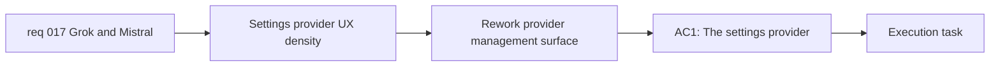

## item_031_rework_settings_provider_management_for_a_growing_provider_catalog - Rework Settings provider management for a growing provider catalog

> From version: 0.1.0
> Schema version: 1.0
> Status: Done
> Understanding: 98%
> Confidence: 97%
> Progress: 100%
> Complexity: Medium
> Theme: UI
> Reminder: Update status/understanding/confidence/progress and linked task references when you edit this doc.

# Problem

- The current `Settings` provider-management layout was shaped for a smaller provider set.
- Adding `Grok` and `Mistral` risks turning the modal into a cramped provider wall if the UX is extended literally.
- Provider choice, active state, descriptions, and key entry need a structure that scales cleanly across desktop and mobile.

# Scope

- In:
  - rework the provider-management UX in `Settings`
  - keep provider scanning, active-provider selection, and key entry understandable as the provider list grows
  - preserve mobile and short-viewport usability
- Out:
  - implementing the actual provider adapters by itself
  - adding advanced account or model preference centers
  - unrelated shell redesign

# Acceptance criteria

- AC1: The `Settings` provider-management UX scales cleanly with the expanded provider list.
- AC2: The selected provider, provider status, and active key entry path remain easy to understand on desktop and mobile.
- AC3: The UX rework preserves the current local-persistence and active-provider model.

# AC Traceability

- AC1 -> Scope: rework the provider-management UX in `Settings`. Proof: settings UX review.
- AC2 -> Scope: keep provider scanning, active-provider selection, and key entry understandable. Proof: desktop and mobile browser validation.
- AC3 -> Scope: preserve the current local-persistence and active-provider model. Proof: settings behavior validation.

# Decision framing

- Product framing: Required
- Product signals: navigation and discoverability, conversion journey
- Product follow-up: Keep provider management lightweight and clear instead of growing into an overcrowded modal.
- Architecture framing: Consider
- Architecture signals: runtime and boundaries
- Architecture follow-up: Keep UI rework aligned with the normalized provider model and modal-system behavior.

# Links

- Product brief(s): `prod_000_mermaid_generator_product_direction`
- Architecture decision(s): `adr_000_choose_a_static_pwa_architecture_for_mermaid_generator`
- Request: `req_017_add_grok_and_mistral_providers_and_rework_settings_provider_ux`
- Primary task(s): `task_005_orchestrate_render_hardening_provider_expansion_and_in_app_changelog_delivery`

# AI Context

- Summary: Rework the Settings provider-management surface so the app can absorb more providers without degrading UX clarity.
- Keywords: settings, provider UX, modal, Grok, Mistral, mobile, byok
- Use when: Use when redesigning the provider section of Settings for a larger provider catalog.
- Skip when: Skip when the work only adds backend/provider plumbing.

# Priority

- Impact: High
- Urgency: Medium

# Notes

- Derived from request `req_017_add_grok_and_mistral_providers_and_rework_settings_provider_ux`.
- This split isolates the settings UX scaling work from the provider adapter implementation.
- Delivered through a structured provider navigation plus detail-pane layout in the Settings modal, preserving local key storage and active-provider switching across desktop and mobile.
