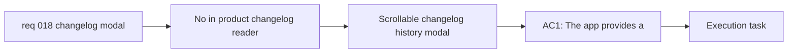

## item_032_add_a_scrollable_in_app_changelog_history_modal - Add a scrollable in-app changelog history modal

> From version: 0.1.0
> Schema version: 1.0
> Status: Done
> Understanding: 98%
> Confidence: 97%
> Progress: 100%
> Complexity: Medium
> Theme: UI
> Reminder: Update status/understanding/confidence/progress and linked task references when you edit this doc.

# Problem

- The app ships changelog files, but users currently have no in-product way to read them.
- Changelog content can be longer than a normal short modal payload, so the reader surface needs proper internal scrolling and readable typography.
- The first in-app changelog surface should expose the app’s changelog history, not only one latest release note.

# Scope

- In:
  - add a dedicated changelog modal inside the app
  - make the modal scrollable and readable for longer changelog history
  - expose all available app changelogs in the first history surface
- Out:
  - building a full documentation center
  - deployment or release automation changes
  - navigation-entry-point work by itself

# Acceptance criteria

- AC1: The app provides a dedicated changelog modal for reading release history in-product.
- AC2: The changelog modal remains scrollable and readable for longer changelog content on desktop and mobile.
- AC3: The first delivered reader surface exposes all available app changelogs rather than only the latest release note.

# AC Traceability

- AC1 -> Scope: add a dedicated changelog modal inside the app. Proof: UI validation.
- AC2 -> Scope: make the modal scrollable and readable. Proof: responsive modal validation.
- AC3 -> Scope: expose all available app changelogs. Proof: changelog-history review.

# Decision framing

- Product framing: Required
- Product signals: navigation and discoverability, experience scope
- Product follow-up: Keep the changelog surface lightweight and informational rather than overbuilding a docs center.
- Architecture framing: Consider
- Architecture signals: runtime and boundaries, content loading
- Architecture follow-up: Load changelog history in a way that fits the static app architecture.

# Links

- Product brief(s): `prod_000_mermaid_generator_product_direction`
- Architecture decision(s): `adr_000_choose_a_static_pwa_architecture_for_mermaid_generator`
- Request: `req_018_add_an_in_app_changelog_modal_accessible_from_settings_and_mobile_navigation`
- Primary task(s): `task_005_orchestrate_render_hardening_provider_expansion_and_in_app_changelog_delivery`

# AI Context

- Summary: Add a readable, scrollable in-app changelog history modal that exposes the app’s available changelogs.
- Keywords: changelog, modal, release notes, history, scrollable, mobile
- Use when: Use when implementing the in-app changelog history reader surface.
- Skip when: Skip when the work only concerns how users open the modal.

# Priority

- Impact: Medium
- Urgency: Medium

# Notes

- Derived from request `req_018_add_an_in_app_changelog_modal_accessible_from_settings_and_mobile_navigation`.
- This split isolates the changelog reader surface itself from its entry points in Settings and mobile navigation.
- Delivered through a scrollable changelog history modal that loads the available versioned changelog files in-app and remains readable on shorter viewports.
