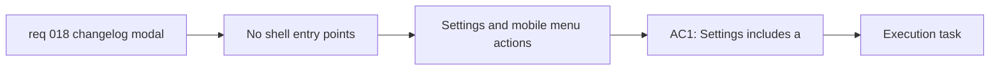

## item_033_add_changelog_entry_points_to_settings_and_mobile_burger_navigation - Add changelog entry points to Settings and mobile burger navigation

> From version: 0.1.0
> Schema version: 1.0
> Status: Done
> Understanding: 98%
> Confidence: 97%
> Progress: 100%
> Complexity: Low
> Theme: UI
> Reminder: Update status/understanding/confidence/progress and linked task references when you edit this doc.

# Problem

- Even with a changelog reader modal, users still need coherent entry points to reach it from the existing app shell.
- Desktop and mobile do not use the same navigation surface, so both `Settings` and the burger menu need explicit access to changelog history.
- The new informational action should integrate cleanly without regressing current settings or burger-menu behavior.

# Scope

- In:
  - add a changelog action inside `Settings`
  - add the same changelog action to the mobile burger menu
  - wire both entry points to the shared changelog modal
- Out:
  - implementing the changelog history reader surface itself
  - changing release automation
  - unrelated settings redesign outside the changelog entry point

# Acceptance criteria

- AC1: `Settings` includes a changelog action that opens the in-app changelog modal.
- AC2: The mobile burger menu includes the same changelog action.
- AC3: Adding these entry points does not regress current navigation behavior in `Settings` or the burger menu.

# AC Traceability

- AC1 -> Scope: add a changelog action inside `Settings`. Proof: settings UI validation.
- AC2 -> Scope: add the same changelog action to the mobile burger menu. Proof: mobile browser validation.
- AC3 -> Scope: wire both entry points to the shared changelog modal. Proof: navigation regression validation.

# Decision framing

- Product framing: Required
- Product signals: navigation and discoverability
- Product follow-up: Keep changelog access discoverable without introducing a new top-level page.
- Architecture framing: Consider
- Architecture signals: runtime and boundaries
- Architecture follow-up: Reuse the existing shell and modal entry-point patterns.

# Links

- Product brief(s): `prod_000_mermaid_generator_product_direction`
- Architecture decision(s): `adr_000_choose_a_static_pwa_architecture_for_mermaid_generator`
- Request: `req_018_add_an_in_app_changelog_modal_accessible_from_settings_and_mobile_navigation`
- Primary task(s): `task_005_orchestrate_render_hardening_provider_expansion_and_in_app_changelog_delivery`

# AI Context

- Summary: Add changelog entry points to Settings and the mobile burger menu so users can open the shared in-app changelog modal from the existing shell.
- Keywords: changelog, settings, burger menu, mobile navigation, entry point, modal
- Use when: Use when wiring changelog access into the current shell.
- Skip when: Skip when the work only concerns modal content rendering.

# Priority

- Impact: Medium
- Urgency: Medium

# Notes

- Derived from request `req_018_add_an_in_app_changelog_modal_accessible_from_settings_and_mobile_navigation`.
- This split keeps shell entry points separate from the changelog history reader surface.
- Delivered through `View changelog history` in Settings and a matching changelog action in the mobile burger menu, both wired to the shared modal without regressing the existing shell behavior.
