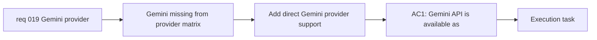

## item_034_add_direct_gemini_provider_support_to_the_browser_side_llm_flow - Add direct Gemini provider support to the browser-side LLM flow

> From version: 0.1.0
> Schema version: 1.0
> Status: Done
> Understanding: 99%
> Confidence: 98%
> Progress: 100%
> Complexity: Medium
> Theme: Integration
> Reminder: Update status/understanding/confidence/progress and linked task references when you edit this doc.

# Problem

- The app’s current direct-provider matrix still lacks `Gemini API`.
- That leaves out one of the most practical low-cost or free-tier providers for a lightweight prompt-to-Mermaid workflow.
- Gemini should fit the same browser-side BYOK and normalized provider contract already used by the existing providers rather than being handled as a special case.

# Scope

- In:
  - add direct `Gemini API` provider support in the LLM adapter layer
  - add Gemini persistence and active-provider support in the current settings flow
  - preserve the normalized prompt-generation contract and current prompt-panel UX
  - surface Gemini readiness and provider-specific failures consistently with the current provider model
- Out:
  - a broader redesign of the provider-management UX by itself
  - server-side relays or project-managed shared secrets
  - model-picking UI beyond the existing provider-level selection

# Acceptance criteria

- AC1: `Gemini API` is available as a direct selectable provider in the app’s provider abstraction.
- AC2: The user can save a Gemini API key locally and use Gemini as the active provider without losing other stored keys.
- AC3: The prompt-generation flow works through the same normalized contract when Gemini is active.
- AC4: Gemini-specific errors are surfaced through the existing provider error UX rather than through ad hoc UI behavior.

# AC Traceability

- AC1 -> Scope: add direct `Gemini API` provider support. Proof: provider configuration review.
- AC2 -> Scope: add Gemini persistence and active-provider support. Proof: settings and local-persistence validation.
- AC3 -> Scope: preserve the normalized prompt-generation contract. Proof: generation-path validation.
- AC4 -> Scope: surface Gemini failures consistently. Proof: provider error-state review.

# Decision framing

- Product framing: Required
- Product signals: experience scope, conversion journey
- Product follow-up: Keep Gemini consistent with the current provider choice model instead of introducing a special-case setup.
- Architecture framing: Required
- Architecture signals: contracts and integration, runtime and boundaries
- Architecture follow-up: Preserve the browser-side BYOK provider contract while expanding the direct-provider matrix.

# Links

- Product brief(s): `prod_000_mermaid_generator_product_direction`
- Architecture decision(s): `adr_000_choose_a_static_pwa_architecture_for_mermaid_generator`
- Request: `req_019_add_gemini_api_as_a_supported_provider`
- Primary task(s): `task_006_orchestrate_gemini_provider_delivery`

# AI Context

- Summary: Add Gemini API as a direct browser-side BYOK provider without breaking the app’s normalized generation contract or provider-management flow.
- Keywords: gemini, google ai, provider, byok, llm, integration, settings, prompt generation
- Use when: Use when implementing Gemini support in the current multi-provider flow.
- Skip when: Skip when the work only concerns generic settings layout or non-provider release chores.

# Priority

- Impact: Medium
- Urgency: Medium

# Notes

- Derived from request `req_019_add_gemini_api_as_a_supported_provider`.
- This backlog slice keeps the Gemini delivery focused and does not reopen the broader provider UX track that was already delivered for the current catalog.
- Delivered through the existing OpenAI-compatible provider helper with Gemini-specific endpoint and provider metadata, while preserving the current settings and prompt-panel behavior.
