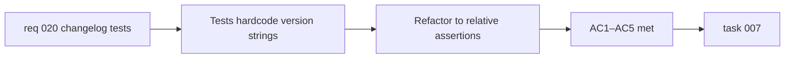

## item_035_make_changelog_tests_release_agnostic - Make changelog tests release-agnostic
> From version: 0.2.0
> Schema version: 1.0
> Status: Ready
> Understanding: 97%
> Confidence: 97%
> Progress: 0%
> Complexity: Small
> Theme: Quality
> Reminder: Update status/understanding/confidence/progress and linked task references when you edit this doc.

# Problem
- `src/tests/changelog.spec.ts` asserts exact version strings (`"0.1.0"`, `"0.2.0"`) when verifying the loaded changelog history.
- Every time a new `CHANGELOGS_<version>.md` file is added, these assertions break even though the actual changelog feature still behaves correctly.
- This creates avoidable release friction: a passing test suite requires a manual test edit that reflects no product bug.

# Scope
- In:
  - refactor changelog test assertions to verify ordering and structure without naming a specific latest version
  - preserve confidence that entries are sorted newest-to-oldest
  - preserve normalization coverage for legacy or partial changelog entry shapes
- Out:
  - changelog UI rendering changes
  - changelog loader implementation changes
  - version bump mechanics

# Acceptance criteria
- AC1: Changelog tests do not depend on a hard-coded latest version string such as `"0.2.0"`.
- AC2: The tests still verify that entries are returned in descending semantic version order.
- AC3: The tests still verify that each loaded entry exposes the structure required by `ChangelogModal`.
- AC4: Normalization coverage for legacy or partial changelog entry shapes remains present.
- AC5: Adding a new `CHANGELOGS_<version>.md` file does not require a test edit unless the actual changelog contract changes.

# AC Traceability
- AC1–AC5 -> `req_020_make_changelog_tests_release_agnostic`: all acceptance criteria map directly to the parent request.

# Decision framing
- Product framing: Required
- Product signals: release workflow, maintainability
- Product follow-up: None beyond making future releases cheaper to ship.
- Architecture framing: Not required
- Architecture signals: none
- Architecture follow-up: None.

# Links
- Product brief(s): `prod_000_mermaid_generator_product_direction`
- Request: `req_020_make_changelog_tests_release_agnostic`
- Primary task(s): `task_007_orchestrate_post_020_audit_hardening_and_quality_wave`

# AI Context
- Summary: Refactor `changelog.spec.ts` so it validates ordering and structure without hardcoding a specific latest release version.
- Keywords: changelog, tests, vitest, release, semantic version, quality, regression
- Use when: Use when touching `src/tests/changelog.spec.ts` or `src/lib/changelog.ts`.
- Skip when: Skip when the work concerns changelog UI rendering, release-note content, or unrelated test files.

# Priority
- Impact: Low
- Urgency: Medium

# Notes
- Derived from `req_020_make_changelog_tests_release_agnostic`.
- This is the only backlog item for req_020 — the scope is narrow and fully self-contained.
