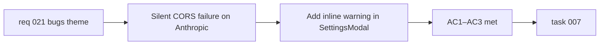

## item_036_surface_anthropic_cors_constraint_as_an_explicit_provider_warning - Surface Anthropic CORS constraint as an explicit provider warning
> From version: 0.2.0
> Schema version: 1.0
> Status: Ready
> Understanding: 98%
> Confidence: 97%
> Progress: 0%
> Complexity: Small
> Theme: Hardening
> Reminder: Update status/understanding/confidence/progress and linked task references when you edit this doc.

# Problem
- The Anthropic provider makes a direct browser call to `https://api.anthropic.com/v1/messages`.
- Anthropic does not whitelist arbitrary browser origins, so this call is blocked by CORS in every standard browser.
- The app currently shows no warning about this constraint: the user saves an Anthropic key, selects the provider, triggers generation, and receives a silent or generic network error.
- All other providers expose OpenAI-compatible endpoints that tolerate browser origins and work without issue.

# Scope
- In:
  - add a visible inline warning inside `SettingsModal` when the Anthropic provider is selected, explaining the CORS limitation and what the user can expect
  - ensure the prompt-panel error surface also presents a provider-specific message when an Anthropic call fails due to CORS rather than a generic network error
  - keep the Anthropic provider in the catalog so users running a local proxy can still configure it
- Out:
  - building or bundling a backend proxy — this remains a static browser-first app
  - removing Anthropic from the provider catalog entirely
  - changes to any other provider's configuration or error surfaces

# Acceptance criteria
- AC1: A visible warning is displayed inside `SettingsModal` when the Anthropic provider is selected, explaining the CORS constraint and that generation will fail in a standard browser without a local proxy.
- AC2: When an Anthropic request fails due to a network-level error (CORS), the prompt-panel error message refers to the provider constraint rather than displaying a generic failure.
- AC3: The Anthropic provider remains available in the catalog and continues to work for users who route requests through a CORS-permissive local proxy.

# AC Traceability
- AC1 -> Scope: inline warning in `SettingsModal`. Proof: UI review when Anthropic is the selected provider.
- AC2 -> Scope: provider-specific error surface in prompt panel. Proof: error-state review when Anthropic call fails.
- AC3 -> Scope: provider stays in catalog. Proof: provider configuration review.

# Decision framing
- Product framing: Required
- Product signals: experience scope, honest UX
- Product follow-up: If a proxy path is introduced later, the warning should be replaced with a working flow rather than just hidden.
- Architecture framing: Not required
- Architecture signals: none
- Architecture follow-up: None — this is a pure UI honesty fix with no architectural change.

# Links
- Product brief(s): `prod_000_mermaid_generator_product_direction`
- Architecture decision(s): `adr_000_choose_a_static_pwa_architecture_for_mermaid_generator`
- Request: `req_021_address_post_020_audit_findings_across_bugs_tests_structure_and_delivery`
- Primary task(s): `task_007_orchestrate_post_020_audit_hardening_and_quality_wave`

# AI Context
- Summary: Add an inline CORS warning to the Anthropic provider settings entry and a provider-specific error message when generation fails, without removing Anthropic from the catalog.
- Keywords: anthropic, CORS, provider, warning, settings, error surface, hardening
- Use when: Use when working on the Anthropic provider entry in `SettingsModal` or the prompt-panel error surface.
- Skip when: Skip when the work concerns other providers, the LLM adapter layer, or proxy infrastructure.

# Priority
- Impact: High
- Urgency: High

# Notes
- Derived from `req_021`, bug theme, AC1.
- This is a UI honesty fix. No backend work is required or in scope.
