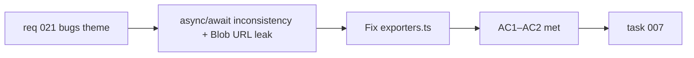

## item_037_fix_exporters_async_inconsistency_and_blob_url_leak_on_error_path - Fix exporters async inconsistency and Blob URL leak on error path
> From version: 0.2.0
> Schema version: 1.0
> Status: Done
> Understanding: 98%
> Confidence: 98%
> Progress: 100%
> Complexity: Small
> Theme: Hardening
> Reminder: Update status/understanding/confidence/progress and linked task references when you edit this doc.

# Problem
- `downloadDiagramAsSvg` in `src/lib/exporters.ts` is declared `async` but contains no `await`. This is semantically misleading and inconsistent with `downloadDiagramAsPng`.
- In the PNG export path, `URL.createObjectURL(blob)` creates a Blob URL that is scheduled for revocation after the Promise resolves. If `image.onerror` fires instead, the revocation never happens and the Blob URL leaks for the lifetime of the page.

# Scope
- In:
  - remove the `async` keyword from `downloadDiagramAsSvg` since it performs no asynchronous operation
  - ensure `URL.revokeObjectURL` is called on both the success path and the `image.onerror` path in `downloadDiagramAsPng`
- Out:
  - changes to the SVG or PNG export logic beyond these two fixes
  - adding unit tests (covered separately in `item_039`)
  - changes to `ExportModal` or any other call site

# Acceptance criteria
- AC1: `downloadDiagramAsSvg` is not declared `async` unless it performs an actual asynchronous operation.
- AC2: `URL.revokeObjectURL` is called on both the success path and the `image.onerror` path in `downloadDiagramAsPng`, with no Blob URL left unreleased on either branch.

# AC Traceability
- AC1 -> Scope: remove `async` from `downloadDiagramAsSvg`. Proof: static code review.
- AC2 -> Scope: ensure revocation on error path. Proof: code review of the PNG export Promise branches.

# Decision framing
- Product framing: Not required
- Product signals: none — this is a defect fix with no user-visible behavior change on the happy path
- Product follow-up: None.
- Architecture framing: Not required
- Architecture signals: none
- Architecture follow-up: None.

# Links
- Product brief(s): `prod_000_mermaid_generator_product_direction`
- Request: `req_021_address_post_020_audit_findings_across_bugs_tests_structure_and_delivery`
- Primary task(s): `task_007_orchestrate_post_020_audit_hardening_and_quality_wave`

# AI Context
- Summary: Remove the spurious `async` from `downloadDiagramAsSvg` and ensure `URL.revokeObjectURL` is called on both the success and error paths of the PNG export flow.
- Keywords: exporters, async, Blob URL, memory leak, revoke, PNG, SVG, defect
- Use when: Use when touching `src/lib/exporters.ts`.
- Skip when: Skip when the work concerns the export modal UI, the export data format, or unrelated download flows.

# Priority
- Impact: Low
- Urgency: Medium

# Notes
- Derived from `req_021`, bug theme, AC2 and AC3.
- The Blob URL leak is a low-severity memory issue (Blob is GC'd on page unload), but it is a real defect and straightforward to fix in the same pass.
