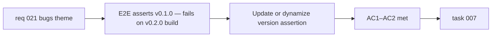

## item_038_fix_stale_version_string_in_e2e_smoke_test - Fix stale version string in E2E smoke test
> From version: 0.2.0
> Schema version: 1.0
> Status: Done
> Understanding: 99%
> Confidence: 99%
> Progress: 100%
> Complexity: Small
> Theme: Quality
> Reminder: Update status/understanding/confidence/progress and linked task references when you edit this doc.

# Problem
- `tests/e2e/smoke.spec.ts` (line 137) asserts `"Mermaid Generator v0.1.0 © 2026"` — a version string that has been `0.2.0` since the last release.
- This assertion fails against the current build without representing any product defect.
- The same root cause will recur with every future release if the assertion stays hardcoded.

# Scope
- In:
  - update the E2E version assertion to match the current version (`0.2.0`) or, preferably, derive it dynamically from the build-injected `__APP_VERSION__` constant so it stays accurate across releases
- Out:
  - changes to the version display component or App.tsx
  - other Playwright test refactors
  - the changelog test version-coupling issue (covered by `item_035`)

# Acceptance criteria
- AC1: The E2E smoke test version assertion passes against the current `0.2.0` build.
- AC2: The version assertion does not require a manual edit on future releases — either it is derived dynamically from the build output, or the test documents explicitly why a manual bump is acceptable.

# AC Traceability
- AC1 -> Scope: assertion matches current version. Proof: `npm run test:e2e` passes on a clean build.
- AC2 -> Scope: assertion is release-agnostic or documented. Proof: code review of the assertion strategy.

# Decision framing
- Product framing: Not required
- Product signals: none — this is a test correctness fix
- Product follow-up: None.
- Architecture framing: Not required
- Architecture signals: none
- Architecture follow-up: None.

# Links
- Product brief(s): `prod_000_mermaid_generator_product_direction`
- Request: `req_021_address_post_020_audit_findings_across_bugs_tests_structure_and_delivery`
- Primary task(s): `task_007_orchestrate_post_020_audit_hardening_and_quality_wave`

# AI Context
- Summary: Fix the stale `v0.1.0` version string assertion in `smoke.spec.ts` and make the assertion resilient to future releases.
- Keywords: playwright, e2e, version, assertion, smoke test, stale, regression
- Use when: Use when touching `tests/e2e/smoke.spec.ts` or the version display logic.
- Skip when: Skip when the work concerns other Playwright scenarios, the changelog test suite, or App.tsx version rendering logic.

# Priority
- Impact: Medium
- Urgency: High

# Notes
- Derived from `req_021`, bug theme, AC4.
- The fix is minimal: either update the string or read `__APP_VERSION__` at test time through a Vite-exposed global or a build artifact read.
