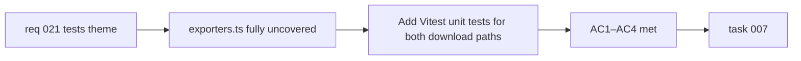

## item_039_add_unit_test_coverage_for_exporters_svg_and_png_download_paths - Add unit test coverage for exporters SVG and PNG download paths
> From version: 0.2.0
> Schema version: 1.0
> Status: Done
> Understanding: 97%
> Confidence: 96%
> Progress: 100%
> Complexity: Medium
> Theme: Quality
> Reminder: Update status/understanding/confidence/progress and linked task references when you edit this doc.

# Problem
- `src/lib/exporters.ts` has zero unit tests.
- Both the SVG download path (`downloadDiagramAsSvg`) and the PNG canvas path (`downloadDiagramAsPng`) are completely uncovered.
- Regressions in export logic — including the Blob URL leak fixed in `item_037` — can be introduced silently with no automated detection.

# Scope
- In:
  - add Vitest unit tests for `downloadDiagramAsSvg`: verify that a Blob URL is created from the SVG input, a download anchor is triggered with the correct filename and MIME type, and the URL is revoked after the click
  - add Vitest unit tests for `downloadDiagramAsPng`: verify that the canvas pipeline is invoked, the Blob is created at the correct scale, the anchor download is triggered, and `URL.revokeObjectURL` is called on both the success and `image.onerror` paths
  - mock browser APIs unavailable in jsdom (`HTMLCanvasElement.prototype.toBlob`, `URL.createObjectURL`, `URL.revokeObjectURL`, anchor click) in the test setup or per-file
- Out:
  - `ExportModal` component tests (UI interaction layer)
  - changes to `exporters.ts` beyond what is needed to make it testable
  - E2E export flow tests (those belong in Playwright)

# Acceptance criteria
- AC1: `downloadDiagramAsSvg` has Vitest test coverage verifying the Blob URL creation, anchor trigger, correct filename/MIME type, and URL revocation.
- AC2: `downloadDiagramAsPng` has Vitest test coverage verifying the canvas pipeline, correct scale application, anchor trigger, and `URL.revokeObjectURL` on both success and error paths.
- AC3: The new tests run in the existing jsdom Vitest environment without requiring a real browser.
- AC4: All existing tests remain green after the new test file is added.

# AC Traceability
- AC1 -> Scope: SVG path unit tests. Proof: `npm run test -- src/tests/exporters.spec.ts`.
- AC2 -> Scope: PNG path unit tests including error branch. Proof: same test run.
- AC3 -> Scope: jsdom compatibility. Proof: test run succeeds without additional browser setup.
- AC4 -> Scope: non-regression. Proof: full `npm run test` passes.

# Decision framing
- Product framing: Not required
- Product signals: none — this is an internal quality improvement
- Product follow-up: None.
- Architecture framing: Not required
- Architecture signals: none
- Architecture follow-up: None.

# Links
- Product brief(s): `prod_000_mermaid_generator_product_direction`
- Request: `req_021_address_post_020_audit_findings_across_bugs_tests_structure_and_delivery`
- Primary task(s): `task_007_orchestrate_post_020_audit_hardening_and_quality_wave`

# AI Context
- Summary: Write a `src/tests/exporters.spec.ts` file covering both the SVG and PNG download flows in `src/lib/exporters.ts` using Vitest with appropriate browser API mocks in jsdom.
- Keywords: exporters, unit tests, vitest, jsdom, SVG, PNG, Blob URL, canvas, download, coverage
- Use when: Use when touching `src/lib/exporters.ts` or adding coverage for the export feature.
- Skip when: Skip when the work concerns the `ExportModal` component, E2E export tests, or the export UI flow.

# Priority
- Impact: Medium
- Urgency: Medium

# Notes
- Derived from `req_021`, tests theme, AC5.
- Depends on `item_037` being completed first so the tests exercise the already-corrected error-path behavior.
