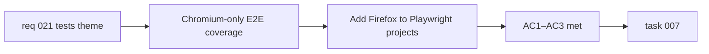

## item_040_expand_playwright_configuration_to_include_firefox - Expand Playwright configuration to include Firefox
> From version: 0.2.0
> Schema version: 1.0
> Status: Ready
> Understanding: 97%
> Confidence: 96%
> Progress: 0%
> Complexity: Small
> Theme: Quality
> Reminder: Update status/understanding/confidence/progress and linked task references when you edit this doc.

# Problem
- `playwright.config.ts` currently runs tests on Chromium only.
- Firefox and Safari/WebKit are excluded, leaving the E2E suite blind to cross-browser regressions in SVG rendering, CSS layout, clipboard behavior, and PWA features.
- The app targets all modern browsers and Chromium-only coverage creates a false sense of confidence.

# Scope
- In:
  - add Firefox (`firefox`) as a second Playwright project in `playwright.config.ts`
  - ensure all existing smoke scenarios pass on Firefox without modification
  - document any Firefox-specific known failures as explicit test skip annotations if unavoidable
- Out:
  - adding Safari/WebKit (that can be a follow-up)
  - adding mobile Playwright projects (Android/iOS emulation)
  - changes to the test scenarios themselves beyond what is needed for Firefox compatibility

# Acceptance criteria
- AC1: `playwright.config.ts` runs the E2E suite on both Chromium and Firefox.
- AC2: All existing smoke scenarios pass on Firefox, or any failure is annotated with an explicit skip and a comment explaining the known browser limitation.
- AC3: The CI command `npm run test:e2e` (or equivalent) exercises both browsers.

# AC Traceability
- AC1 -> Scope: Firefox project added. Proof: `playwright.config.ts` review.
- AC2 -> Scope: all scenarios pass or are explicitly skipped. Proof: `npm run test:e2e` output.
- AC3 -> Scope: CI command exercises both browsers. Proof: test run output.

# Decision framing
- Product framing: Not required
- Product signals: none — this is a quality gate improvement
- Product follow-up: Consider adding WebKit/Safari in a follow-up slice.
- Architecture framing: Not required
- Architecture signals: none
- Architecture follow-up: None.

# Links
- Product brief(s): `prod_000_mermaid_generator_product_direction`
- Request: `req_021_address_post_020_audit_findings_across_bugs_tests_structure_and_delivery`
- Primary task(s): `task_007_orchestrate_post_020_audit_hardening_and_quality_wave`

# AI Context
- Summary: Add Firefox as a second Playwright project in `playwright.config.ts` and ensure all existing smoke scenarios pass on Firefox.
- Keywords: playwright, firefox, cross-browser, e2e, smoke test, configuration
- Use when: Use when touching `playwright.config.ts` or the E2E test suite.
- Skip when: Skip when the work concerns unit tests, Vitest, or the Chromium-specific test behavior.

# Priority
- Impact: Medium
- Urgency: Low

# Notes
- Derived from `req_021`, tests theme, AC6.
- Firefox is likely to pass all existing scenarios without modification given the app's use of standard Web APIs.
