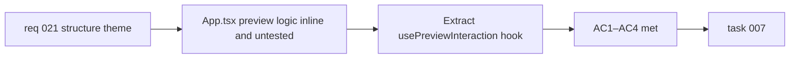

## item_041_extract_preview_interaction_logic_from_app_into_use_preview_interaction_hook - Extract preview interaction logic from App into usePreviewInteraction hook
> From version: 0.2.0
> Schema version: 1.0
> Status: Done
> Understanding: 97%
> Confidence: 96%
> Progress: 100%
> Complexity: Medium
> Theme: Structure
> Reminder: Update status/understanding/confidence/progress and linked task references when you edit this doc.

# Problem
- `src/App.tsx` concentrates over 1000 lines including all preview interaction state and handlers: viewport state, zoom, pan, fit, cursor-based wheel zoom, and the ResizeObserver fit logic.
- This concentration increases regression risk when any preview interaction behavior changes, and makes it hard to test the wheel-zoom coordinate translation logic in isolation.
- The `handlePreviewWheel` zoom-with-cursor logic has no dedicated unit test because the function is defined inline in App.tsx alongside unrelated state.

# Scope
- In:
  - extract viewport state (`viewport`, `setViewport`), the zoom/pan/fit handlers, `handlePreviewWheel`, the ResizeObserver fit effect, and the related utility calls (`clampScale`, `centerViewport`, `fitViewport`) into a `usePreviewInteraction` custom hook in `src/hooks/usePreviewInteraction.ts`
  - add a dedicated unit test for the `handlePreviewWheel` coordinate translation logic
  - keep the `PreviewPanel` component and `App.tsx` interfaces unchanged — only the internal organization moves
- Out:
  - changes to `PreviewPanel` props or rendered output
  - changes to any other App.tsx state beyond preview interaction
  - the export and changelog hook extractions (covered in `item_042`)

# Acceptance criteria
- AC1: Viewport state, zoom/pan/fit handlers, `handlePreviewWheel`, and the ResizeObserver fit effect live in `src/hooks/usePreviewInteraction.ts` and are consumed by `App.tsx` via the hook.
- AC2: `App.tsx` does not contain any viewport or preview interaction state or handler logic after the extraction.
- AC3: A Vitest unit test covers the `handlePreviewWheel` coordinate translation — specifically that zoom is applied relative to the cursor position and the resulting viewport remains within `clampScale` bounds.
- AC4: All existing tests and E2E scenarios remain green.

# AC Traceability
- AC1 -> Scope: hook extraction. Proof: file diff and code review.
- AC2 -> Scope: App.tsx cleanliness. Proof: code review.
- AC3 -> Scope: wheel zoom unit test. Proof: `npm run test -- src/tests/usePreviewInteraction.spec.ts`.
- AC4 -> Scope: non-regression. Proof: `npm run ci:local` passes.

# Decision framing
- Product framing: Not required
- Product signals: none — pure internal refactor
- Product follow-up: None.
- Architecture framing: Not required
- Architecture signals: none
- Architecture follow-up: None.

# Links
- Product brief(s): `prod_000_mermaid_generator_product_direction`
- Request: `req_021_address_post_020_audit_findings_across_bugs_tests_structure_and_delivery`
- Primary task(s): `task_007_orchestrate_post_020_audit_hardening_and_quality_wave`

# AI Context
- Summary: Move all viewport and preview interaction logic from `App.tsx` into a `usePreviewInteraction` hook and add a unit test for the wheel-zoom coordinate translation.
- Keywords: refactor, custom hook, usePreviewInteraction, viewport, zoom, pan, fit, ResizeObserver, App.tsx, structure
- Use when: Use when touching preview interaction logic, zoom/pan state, or `PreviewPanel` integration.
- Skip when: Skip when the work concerns the export flow, the changelog, the prompt panel, or other App.tsx areas.

# Priority
- Impact: Medium
- Urgency: Low

# Notes
- Derived from `req_021`, structure theme, AC7.
- The hook extraction must not change any observable behavior. The existing E2E suite acts as the primary regression guard.
