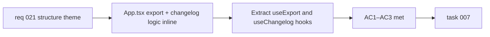

## item_042_extract_export_orchestration_and_changelog_loading_from_app_into_dedicated_hooks - Extract export orchestration and changelog loading from App into dedicated hooks
> From version: 0.2.0
> Schema version: 1.0
> Status: Done
> Understanding: 97%
> Confidence: 96%
> Progress: 100%
> Complexity: Medium
> Theme: Structure
> Reminder: Update status/understanding/confidence/progress and linked task references when you edit this doc.

# Problem
- `src/App.tsx` contains export orchestration logic (`handleExport`, format/scale state, coordination with `exporters.ts`) and changelog loading logic (`requestChangelogEntries`, changelog state, `useEffectEvent` binding) inline alongside unrelated application state.
- Both concerns are self-contained, independently testable, and have clear boundaries — they are a natural fit for custom hooks.
- Keeping them in App.tsx makes the file progressively harder to read and maintain as the product grows.

# Scope
- In:
  - extract export-related state (`exportFormat`, `exportScale`, `handleExport`) and its coordination with `exporters.ts` into `src/hooks/useExport.ts`
  - extract changelog loading state (`changelogEntries`, `requestChangelogEntries`, the `useEffectEvent`-bound loader) into `src/hooks/useChangelog.ts`
  - keep `App.tsx` as the consumer of both hooks with no behavioral change
- Out:
  - changes to `ExportModal` or `ChangelogModal` props or rendered output
  - preview interaction extraction (covered in `item_041`)
  - AppHeader button unification or path alias changes (covered in `item_043`)

# Acceptance criteria
- AC1: Export state and `handleExport` logic live in `src/hooks/useExport.ts` and are consumed by `App.tsx` through the hook.
- AC2: Changelog loading state and the `requestChangelogEntries` function live in `src/hooks/useChangelog.ts` and are consumed by `App.tsx` through the hook.
- AC3: All existing tests and E2E scenarios remain green after the extraction.

# AC Traceability
- AC1 -> Scope: useExport extraction. Proof: file diff and code review.
- AC2 -> Scope: useChangelog extraction. Proof: file diff and code review.
- AC3 -> Scope: non-regression. Proof: `npm run ci:local` passes.

# Decision framing
- Product framing: Not required
- Product signals: none — pure internal refactor
- Product follow-up: None.
- Architecture framing: Not required
- Architecture signals: none
- Architecture follow-up: None.

# Links
- Product brief(s): `prod_000_mermaid_generator_product_direction`
- Request: `req_021_address_post_020_audit_findings_across_bugs_tests_structure_and_delivery`
- Primary task(s): `task_007_orchestrate_post_020_audit_hardening_and_quality_wave`

# AI Context
- Summary: Move export orchestration into `useExport.ts` and changelog loading into `useChangelog.ts`, both consumed by `App.tsx` via hooks, with no behavioral change.
- Keywords: refactor, custom hook, useExport, useChangelog, App.tsx, structure, export, changelog, loading
- Use when: Use when touching export logic, changelog loading, or reducing App.tsx line count.
- Skip when: Skip when the work concerns preview interaction (item_041), AppHeader, path aliases, or modal UI.

# Priority
- Impact: Medium
- Urgency: Low

# Notes
- Derived from `req_021`, structure theme, AC7.
- Should be executed after or alongside `item_041` to maximize the structural reduction in App.tsx in a single pass.
- Depends on `item_037` being complete so the export hook wraps already-corrected exporter functions.
