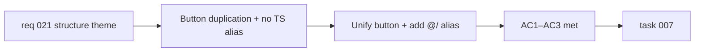

## item_043_unify_appheader_action_button_and_add_typescript_path_alias - Unify AppHeader action button duplication and add TypeScript path alias
> From version: 0.2.0
> Schema version: 1.0
> Status: Ready
> Understanding: 97%
> Confidence: 96%
> Progress: 0%
> Complexity: Small
> Theme: Structure
> Reminder: Update status/understanding/confidence/progress and linked task references when you edit this doc.

# Problem
- `src/components/shell/AppHeader.tsx` defines two separate components — `HeaderActionButton` and `MobileMenuActionButton` — with near-identical interfaces and props that differ only by their rendering context (topbar vs. mobile menu). This duplication means any future change to the button API must be applied in two places.
- No TypeScript path alias is configured. All imports across the codebase use relative paths (`../../lib/llm`), which makes file moves fragile and imports harder to read in deeply nested files.

# Scope
- In:
  - collapse `HeaderActionButton` and `MobileMenuActionButton` into a single `ActionButton` component with a `variant: "topbar" | "mobile"` prop inside `AppHeader.tsx`
  - add a `@/` path alias pointing to `src/` in `tsconfig.app.json` and `vite.config.ts`
  - apply the `@/` alias to existing imports across the codebase
- Out:
  - changes to button behavior, styling, or accessibility beyond the unification
  - changes to other components in `AppHeader.tsx` beyond the button pair
  - extraction of hooks from App.tsx (covered in `item_041` and `item_042`)

# Acceptance criteria
- AC1: `HeaderActionButton` and `MobileMenuActionButton` are replaced by a single `ActionButton` component in `AppHeader.tsx`, and all call sites are updated.
- AC2: A `@/` TypeScript path alias resolving to `src/` is configured in `tsconfig.app.json` and `vite.config.ts`.
- AC3: Existing imports across the codebase are updated to use `@/` where applicable, and the build, lint, and tests pass.

# AC Traceability
- AC1 -> Scope: button unification. Proof: code review and `AppHeader.tsx` diff.
- AC2 -> Scope: alias configuration. Proof: `tsconfig.app.json` and `vite.config.ts` review.
- AC3 -> Scope: import migration. Proof: `npm run ci:local` passes.

# Decision framing
- Product framing: Not required
- Product signals: none — pure structural improvement
- Product follow-up: None.
- Architecture framing: Not required
- Architecture signals: none
- Architecture follow-up: None.

# Links
- Product brief(s): `prod_000_mermaid_generator_product_direction`
- Request: `req_021_address_post_020_audit_findings_across_bugs_tests_structure_and_delivery`
- Primary task(s): `task_007_orchestrate_post_020_audit_hardening_and_quality_wave`

# AI Context
- Summary: Replace `HeaderActionButton` / `MobileMenuActionButton` with a single `ActionButton variant` component, and add a `@/` TypeScript alias to `src/` with import migration across the codebase.
- Keywords: refactor, AppHeader, ActionButton, variant, TypeScript alias, path alias, @/, tsconfig, vite, imports
- Use when: Use when touching `AppHeader.tsx`, import paths, or TypeScript configuration.
- Skip when: Skip when the work concerns hook extractions, export logic, or modal components.

# Priority
- Impact: Low
- Urgency: Low

# Notes
- Derived from `req_021`, structure theme, AC8 and AC9.
- These two concerns are grouped in a single item because both are cosmetic/structural and neither depends on the other — they can be executed in the same commit batch.
