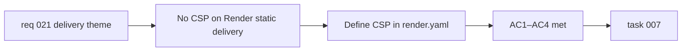

## item_044_add_content_security_policy_header_to_render_static_delivery - Add Content Security Policy header to Render static delivery
> From version: 0.2.0
> Schema version: 1.0
> Status: Done
> Understanding: 97%
> Confidence: 95%
> Progress: 100%
> Complexity: Medium
> Theme: Hardening
> Reminder: Update status/understanding/confidence/progress and linked task references when you edit this doc.

# Problem
- `render.yaml` configures no `Content-Security-Policy` header for the static site.
- The app injects Mermaid-generated SVG into the DOM via `dangerouslySetInnerHTML` (even though it is sanitized before injection).
- Without a CSP, a bypass in the sanitization logic or a dependency-chain vulnerability would have no defense in depth on the delivery layer.
- A CSP also provides meaningful protection against XSS from third-party scripts, inline event handlers, and eval-based code paths.

# Scope
- In:
  - define a `Content-Security-Policy` header in `render.yaml` covering at minimum: `default-src 'self'`, explicit `script-src`, `style-src`, `img-src` (for data URIs in SVG/PNG export), `connect-src` (for LLM API calls to external providers), and `worker-src` (for the Service Worker)
  - validate that the CSP does not break the SVG rendering path, the PWA Service Worker, the clipboard API, the LLM provider fetch calls, or the share-link URL hydration
  - add `unsafe-inline` for styles only if strictly required by the current Mermaid CSS injection pattern, and document the reason explicitly
  - block `unsafe-eval` unconditionally
- Out:
  - changes to the Mermaid rendering or sanitization logic
  - Subresource Integrity (SRI) for external scripts (no external scripts are currently loaded)
  - CORS header configuration (a separate concern)

# Acceptance criteria
- AC1: `render.yaml` includes a `Content-Security-Policy` response header applied to all routes.
- AC2: The CSP blocks `unsafe-eval` unconditionally.
- AC3: All existing user flows — SVG rendering, PWA Service Worker registration, LLM API calls to all six providers, clipboard copy, share-link hydration, PNG/SVG export — continue to work under the CSP.
- AC4: Any `unsafe-inline` directive, if included, is accompanied by a comment explaining which browser API or library requires it and why it cannot be removed.

# AC Traceability
- AC1 -> Scope: CSP header in `render.yaml`. Proof: `render.yaml` review.
- AC2 -> Scope: `unsafe-eval` blocked. Proof: CSP value review.
- AC3 -> Scope: no breakage. Proof: manual browser validation and `npm run test:e2e` on a deployed preview.
- AC4 -> Scope: unsafe-inline documentation. Proof: inline comment review in `render.yaml`.

# Decision framing
- Product framing: Not required
- Product signals: none — this is a delivery security improvement
- Product follow-up: Consider tightening `unsafe-inline` for styles in a follow-up once Mermaid's CSS injection pattern is understood more precisely.
- Architecture framing: Required
- Architecture signals: runtime and boundaries, security model
- Architecture follow-up: Document the CSP directives and their rationale in the ADR or a new security note.

# Links
- Product brief(s): `prod_000_mermaid_generator_product_direction`
- Architecture decision(s): `adr_000_choose_a_static_pwa_architecture_for_mermaid_generator`
- Request: `req_021_address_post_020_audit_findings_across_bugs_tests_structure_and_delivery`
- Primary task(s): `task_007_orchestrate_post_020_audit_hardening_and_quality_wave`

# AI Context
- Summary: Add a `Content-Security-Policy` header to `render.yaml` that blocks `unsafe-eval`, allows the Service Worker, covers LLM provider fetch origins and data URIs, and does not break any existing user flow.
- Keywords: CSP, Content-Security-Policy, render.yaml, security, delivery, Render, static site, hardening
- Use when: Use when touching `render.yaml`, delivery headers, or security hardening on the hosting layer.
- Skip when: Skip when the work concerns the Mermaid rendering pipeline, SVG sanitization, or LLM provider logic.

# Priority
- Impact: Medium
- Urgency: Medium

# Notes
- Derived from `req_021`, delivery theme, AC10.
- The main risk during implementation is that Mermaid's generated SVG uses inline `style` attributes. Validate carefully on a deployed preview before merging, since jsdom test runs do not exercise the CSP.
- All six LLM provider base URLs must appear in `connect-src`: `api.openai.com`, `openrouter.ai`, `api.anthropic.com`, `api.x.ai`, `api.mistral.ai`, `generativelanguage.googleapis.com`.
