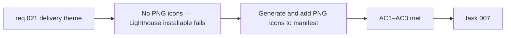

## item_045_add_png_icons_to_pwa_manifest_for_installability - Add PNG icons to PWA manifest for installability
> From version: 0.2.0
> Schema version: 1.0
> Status: Done
> Understanding: 97%
> Confidence: 96%
> Progress: 100%
> Complexity: Small
> Theme: Hardening
> Reminder: Update status/understanding/confidence/progress and linked task references when you edit this doc.

# Problem
- The PWA manifest currently references only an SVG icon.
- Most Android browsers and Lighthouse's installability check require a PNG icon at 192×192 and ideally a maskable icon at 512×512.
- Without these, the Lighthouse "installable" audit fails and add-to-home-screen on Android either falls back to a generic icon or does not offer installation at all.

# Scope
- In:
  - generate PNG icons at 192×192 and 512×512 from the existing SVG source (via a build script, a Vite plugin, or committed build artifacts)
  - add both PNG sizes to the PWA manifest with correct `type`, `sizes`, and `purpose` fields (`any` for 192×192, `maskable any` for 512×512)
  - preserve the existing SVG icon entry in the manifest alongside the PNG entries
  - validate that the Lighthouse PWA installability check passes after the change
- Out:
  - changes to the icon design or branding
  - generating additional icon sizes beyond 192×192 and 512×512
  - changes to the manifest display mode, theme color, or other manifest fields

# Acceptance criteria
- AC1: A PNG icon at 192×192 is present in the public assets and referenced in the PWA manifest with `"purpose": "any"`.
- AC2: A PNG icon at 512×512 is present in the public assets and referenced in the PWA manifest with `"purpose": "maskable any"`.
- AC3: The Lighthouse PWA installability check passes on a deployed build.

# AC Traceability
- AC1 -> Scope: 192×192 PNG added and referenced. Proof: manifest review and public assets review.
- AC2 -> Scope: 512×512 PNG added and referenced. Proof: manifest review and public assets review.
- AC3 -> Scope: installability check passes. Proof: Lighthouse report on a deployed preview.

# Decision framing
- Product framing: Required
- Product signals: experience scope (installability on mobile)
- Product follow-up: Consider adding a maskable icon with proper safe-zone padding in a follow-up if the auto-generated PNG does not render well in circular icon crops.
- Architecture framing: Not required
- Architecture signals: none
- Architecture follow-up: None.

# Links
- Product brief(s): `prod_000_mermaid_generator_product_direction`
- Architecture decision(s): `adr_000_choose_a_static_pwa_architecture_for_mermaid_generator`
- Request: `req_021_address_post_020_audit_findings_across_bugs_tests_structure_and_delivery`
- Primary task(s): `task_007_orchestrate_post_020_audit_hardening_and_quality_wave`

# AI Context
- Summary: Generate PNG icons at 192×192 and 512×512 from the existing SVG and add them to the PWA manifest alongside the existing SVG entry so the Lighthouse installability check passes.
- Keywords: PWA, manifest, icons, PNG, 192, 512, maskable, installability, Lighthouse, vite-plugin-pwa
- Use when: Use when touching the PWA manifest, icon assets, or `vite.config.ts` PWA plugin configuration.
- Skip when: Skip when the work concerns CSP headers, SVG rendering, or non-PWA delivery concerns.

# Priority
- Impact: Medium
- Urgency: Low

# Notes
- Derived from `req_021`, delivery theme, AC11.
- `vite-plugin-pwa` supports icon generation via the `@vite-pwa/assets-generator` companion tool. Using it avoids committing binary assets to the repo and keeps generation reproducible from the source SVG.
