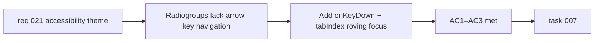

## item_046_implement_arrow_key_navigation_for_provider_and_scale_radiogroups - Implement arrow-key navigation for provider and scale radiogroups
> From version: 0.2.0
> Schema version: 1.0
> Status: Done
> Understanding: 97%
> Confidence: 96%
> Progress: 100%
> Complexity: Small
> Theme: Accessibility
> Reminder: Update status/understanding/confidence/progress and linked task references when you edit this doc.

# Problem
- `SettingsModal` and `ExportModal` both use `<button role="radio">` elements grouped under `role="radiogroup"` to render provider and scale option lists.
- These groups do not implement the arrow-key navigation behavior required by the WAI-ARIA radiogroup pattern: pressing ArrowDown/ArrowRight should move focus to the next option, pressing ArrowUp/ArrowLeft should move to the previous option, and the currently selected option should be the only one in the natural tab order.
- Keyboard users and screen reader users relying on the expected radiogroup interaction cannot cycle through options without tabbing through every button in the group.

# Scope
- In:
  - add `onKeyDown` handlers on the radiogroup containers (or individual radio buttons) in `SettingsModal` and `ExportModal` that implement ArrowDown/ArrowRight (next option) and ArrowUp/ArrowLeft (previous option) navigation with wrapping
  - apply `tabIndex={0}` to the currently selected radio and `tabIndex={-1}` to all others so the group is a single Tab stop
  - ensure focus is moved programmatically to the newly activated option when the user navigates with arrow keys
- Out:
  - changes to the visual styling of the radiogroup buttons
  - changes to how the selected value is stored or communicated
  - extraction of a generic RadioGroup component (acceptable but not required)

# Acceptance criteria
- AC1: Pressing ArrowDown or ArrowRight within the provider or scale radiogroup moves focus to and activates the next option, wrapping from the last option to the first.
- AC2: Pressing ArrowUp or ArrowLeft moves focus to and activates the previous option, wrapping from the first to the last.
- AC3: The radiogroup is a single Tab stop — only the currently active option has `tabIndex={0}`, all others have `tabIndex={-1}`.

# AC Traceability
- AC1 -> Scope: ArrowDown/Right handler. Proof: keyboard interaction test or manual review.
- AC2 -> Scope: ArrowUp/Left handler. Proof: keyboard interaction test or manual review.
- AC3 -> Scope: roving tabIndex. Proof: DOM inspection with the keyboard.

# Decision framing
- Product framing: Not required
- Product signals: accessibility, inclusion
- Product follow-up: Consider extracting a generic `RadioGroup` component if a third radiogroup is added in the future.
- Architecture framing: Not required
- Architecture signals: none
- Architecture follow-up: None.

# Links
- Product brief(s): `prod_000_mermaid_generator_product_direction`
- Request: `req_021_address_post_020_audit_findings_across_bugs_tests_structure_and_delivery`
- Primary task(s): `task_007_orchestrate_post_020_audit_hardening_and_quality_wave`

# AI Context
- Summary: Add ArrowDown/Up/Left/Right key handlers and roving `tabIndex` to the provider radiogroup in `SettingsModal` and the scale radiogroup in `ExportModal` to conform to the WAI-ARIA radiogroup keyboard pattern.
- Keywords: accessibility, a11y, radiogroup, WAI-ARIA, keyboard navigation, arrow key, tabIndex, SettingsModal, ExportModal
- Use when: Use when touching `SettingsModal.tsx`, `ExportModal.tsx`, or keyboard accessibility in modal controls.
- Skip when: Skip when the work concerns provider logic, export format, modal scroll behavior, or other accessibility concerns.

# Priority
- Impact: Low
- Urgency: Low

# Notes
- Derived from `req_021`, accessibility theme, AC12.
- The roving tabIndex pattern is straightforward: on mount and on value change, set `tabIndex={0}` on the selected button and `tabIndex={-1}` on all others. The `onKeyDown` handler calls `element.focus()` on the target option after computing the new index.
